# RQ1 结果：vLLM 的真实工程 workload 是什么

## 摘要结论

vLLM 的工程 workload 不是某一种占绝对主导的“修 bug”或“加模型”，而是一个
**高吞吐、技术异构、频繁跨边界的 AI inference systems 工程组合**：

- 输入侧，2026 年 1–7 月平均每月 2,102.6 个 PR，几乎是 2025 年的两倍；活跃
  non-bot PR 作者和首次出现的 PR 作者增长得更快。
- 内容侧，bugfix 是最大单类（40.4%），但 feature、performance、refactor、test、
  CI、build、documentation 等共同占 59.6%，不能用单一 bug-fix benchmark 代表。
- 表面侧，76.5% 修改 production code，44.6% 修改 tests；44.3% 同时跨越多个
  project scope，其中 production code + tests 一项就占 35.1%。
- 架构侧，production workload 分散在 kernel/operator、model implementation、
  attention、MoE、quantization、serving、KV cache、model runner、compilation 等多层；
  39.0% 的 PR 同时影响两个及以上 production component。
- 硬件侧，49.4% backend-agnostic，42.4% 明确影响一个后端，8.2% 跨多个后端。
  NVIDIA CUDA、AMD ROCm、CPU、Intel XPU、TPU 等都形成真实维护工作面。
- 联合结构上，最大 archetype 不是局部单文件任务，而是“production bugfix +
  multi-component + backend-specific”（7.95%）。Feature 和 performance 的头部
  archetype 同样大量跨组件、涉及具体硬件。

因此，RQ1 对 RQ2 的约束不是“从 merged PR 中随机抽题”，而是保留 intent × scope ×
architecture × hardware × integration breadth 的联合结构；再把这些技术单元映射成
diagnosis、implementation、review、revision 和 performance-engineering 等不同任务契约。

## 1. 工作量增长发生在哪里

下表比较完整 2025 与 2026 年 1–7 月的月均值：

| 指标 | 2025 月均 | 2026 Jan–Jul 月均 | 相对变化 |
| --- | ---: | ---: | ---: |
| Issues opened | 578.2 | 609.9 | +5.5% |
| PRs opened（all） | 1,068.6 | 2,102.6 | +96.8% |
| PRs opened（non-bot） | 1,066.3 | 2,092.0 | +96.2% |
| PRs merged | 720.1 | 974.4 | +35.3% |
| 活跃 non-bot PR 作者 | 369.4 | 786.7 | +113.0% |
| 首次出现的 non-bot PR 作者 | 166.0 | 403.6 | +143.1% |
| snapshot-collaborator submitted reviews | 2,316.7 | 2,727.3 | +17.7% |
| active snapshot reviewers | 54.3 | 58.0 | +6.9% |
| snapshot-collaborator inline comments | 1,949.3 | 2,003.4 | +2.8% |

精确表见 [`ecosystem_2025_vs_2026_change.csv`](tables/ecosystem_2025_vs_2026_change.csv)。

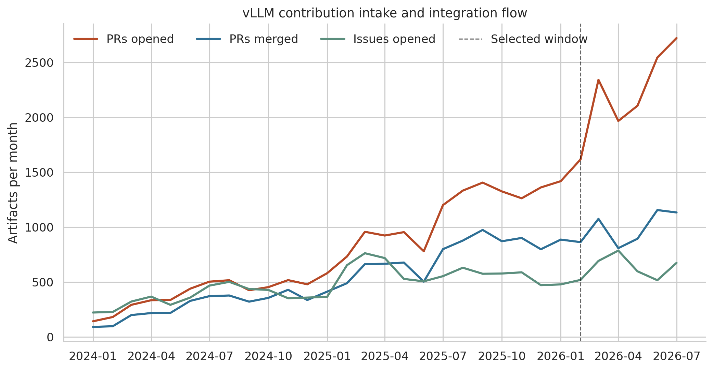

这组数据支持三个互相区别的观察：

1. vLLM 的需求/反馈入口（Issue）仍在增长，但 PR 贡献输入增长更陡。
2. 作者池不是简单地由原有贡献者提高频率：月活作者约增 113%，首次出现作者约增
   143%。这是一个显著扩大的 contributor funnel。
3. merge、review 和 active reviewer 均增长，但没有按 PR 输入同比增长。它说明整合面
   变得更拥挤；它不是“代码 benchmark 能解决维护者人力”的因果主张。

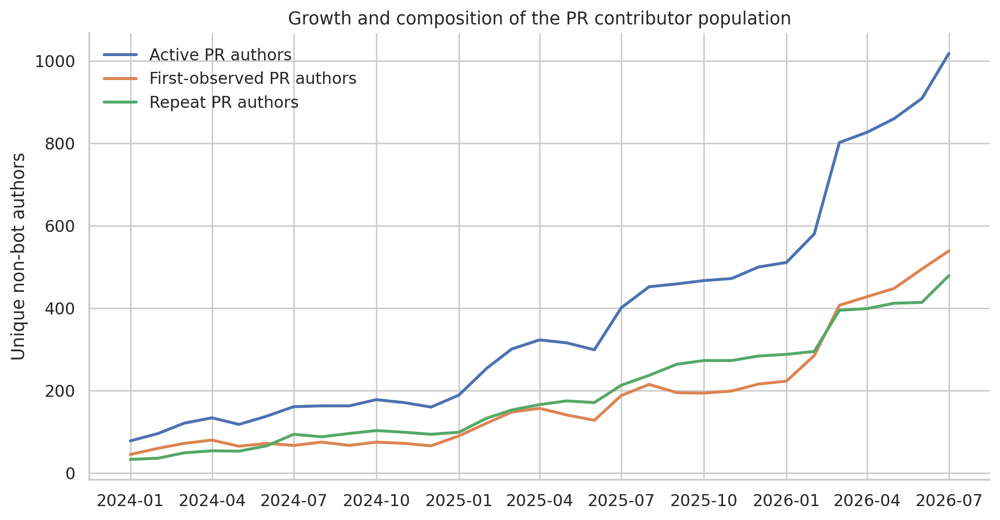

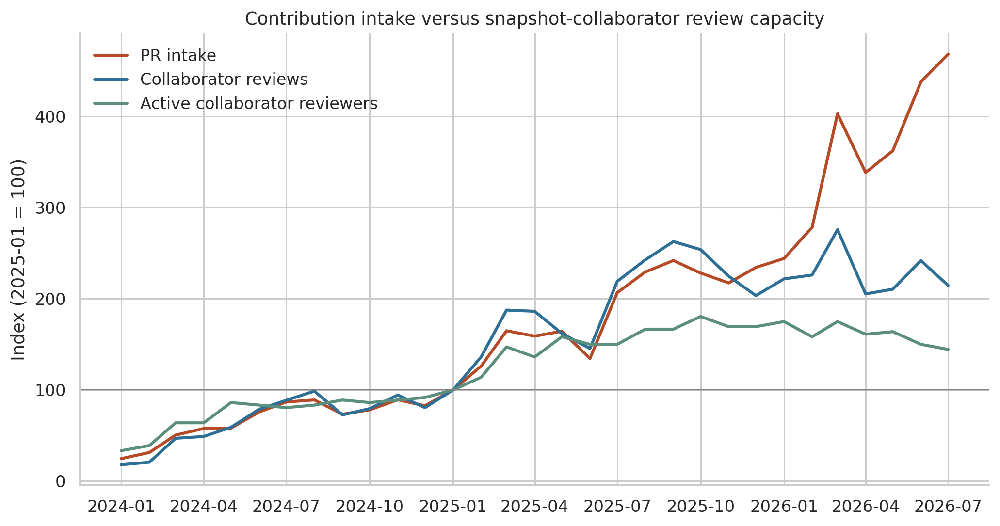

截至 cutoff，仓库有 4,194 个 open PR（其中 4,179 个 non-bot）和 2,055 个 open
Issue。2026 Jan–Jul 创建的 14,718 个 PR 中，remote empirical branch 统计 10,993 个
来自 external non-bot 作者（74.7%）；这一分母包括 open、closed-unmerged 和 merged。

这也是为什么不能把 5,662 个 merged PR 直接称为“全部维护工作”。旧分析显示，2026
cohort 的 merged PR 承担 81.4% 的 roster submitted review、74.1% 的 inline comment；
只观察 merged PR 会遗漏 18.6% 和 25.9% 的对应 review events。本文把全量 envelope
作为背景、把 merged 深度标签称为 **integrated technical workload**。

## 2. 深度标签覆盖是否足够

目标总体是 2026-02 至 2026-07 全部 5,662 个 merged PR。冻结快照中：

- 5,636 条通过完整 tagging schema；
- 另 13 条只在 verification/reproduction 的一致性或空白格式规则失败，但四个 RQ1
  core dimensions 均独立合法；
- 13 条尚未出现在快照；
- 因此 RQ1 core coverage = 5,649/5,662 = **99.77%**。

最坏情况下，把 13 条 missing 全放入同一个标签，只会使任一全体比例绝对变化 0.23
个百分点。每月有效分母为 Feb 861、Mar 1,072、Apr 801、May 853、Jun 1,036、
Jul 1,026。没有对 missing PR 插值。

## 3. Dominant intent：它们为什么存在

| change_type | n | share | 95% Wilson CI |
| --- | ---: | ---: | ---: |
| bugfix | 2,284 | 40.43% | [39.16%, 41.72%] |
| feature | 955 | 16.91% | [15.95%, 17.91%] |
| performance | 616 | 10.90% | [10.12%, 11.74%] |
| test | 455 | 8.05% | [7.37%, 8.79%] |
| refactor | 443 | 7.84% | [7.17%, 8.57%] |
| ci | 356 | 6.30% | [5.70%, 6.97%] |
| documentation | 220 | 3.89% | [3.42%, 4.43%] |
| build | 202 | 3.58% | [3.12%, 4.09%] |
| maintenance | 97 | 1.72% | [1.41%, 2.09%] |
| other | 21 | 0.37% | [0.24%, 0.57%] |

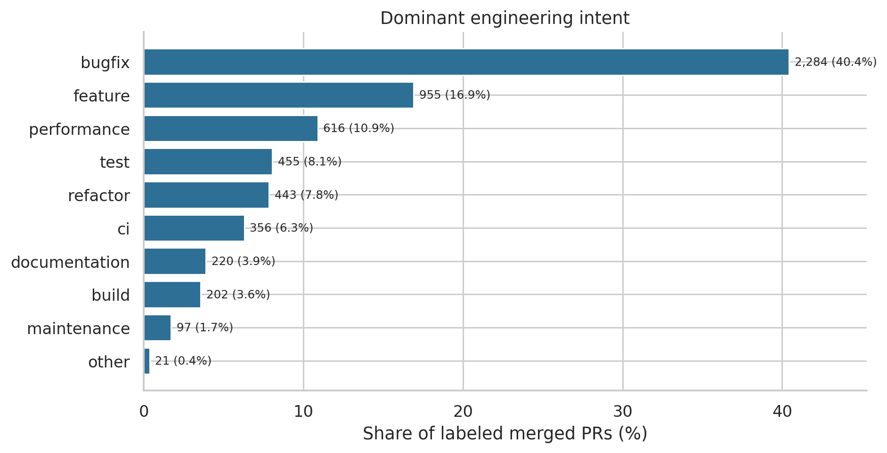

Bugfix 在六个月中稳定保持约 37.9%–42.3%，而不是由某一个月异常驱动。Feature 为
14.2%–19.5%，performance 为 8.6%–13.0%。这支持把它们看作稳定 workload mix，
但六个月仍不足以主张长期平稳分布。

## 4. Project scope：改的是项目的哪种表面

`project_scope` 是 multi-label，以下比例不会相加为 100%：

| project_scope | n | share |
| --- | ---: | ---: |
| production_code | 4,321 | 76.49% |
| tests | 2,519 | 44.59% |
| documentation_examples | 684 | 12.11% |
| ci | 613 | 10.85% |
| build | 513 | 9.08% |
| benchmarks | 197 | 3.49% |
| developer_tooling | 150 | 2.66% |

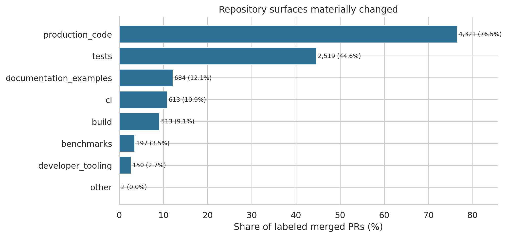

2,500 个 PR（44.26%）跨多个 scope。最主要的组合是 production code + tests：
1,980 个（35.05%）。之后是 production code + documentation（7.29%）、tests + docs
（5.88%）、tests + CI（4.82%）、production code + build（4.28%）。

这说明 build、CI、文档和 tooling 不是“taxonomy 没 cover 的噪声”，而是项目 workload
的明确组成；它们只是不会被强行塞入 production architecture component。

## 5. Architecture：vLLM 的哪些系统边界在变化

`support_only` 有 1,328 个（23.51%），表示只改 test/build/CI/docs/tooling，没有
production component change。其余 4,321 个 production-code PR 分布在多个层次：

| architecture label | n | share of all labeled PRs |
| --- | ---: | ---: |
| kernels_operators | 962 | 17.03% |
| model_implementation | 792 | 14.02% |
| attention | 662 | 11.72% |
| moe | 608 | 10.76% |
| quantization | 588 | 10.41% |
| serving_api | 577 | 10.21% |
| kv_cache_data_movement | 523 | 9.26% |
| worker_model_runner | 490 | 8.67% |
| compilation | 411 | 7.28% |
| speculative_decoding | 328 | 5.81% |
| model_loading_layers | 320 | 5.66% |
| distributed_execution | 306 | 5.42% |

其余 scheduler、engine、sampling、LoRA、device platform、observability 和 shared
infrastructure 等见完整表。

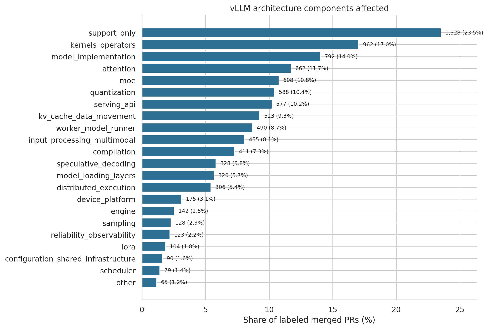

2,204 个 PR（39.02%）同时触及两个及以上 production component。最高频 pair 是：

- kernels + quantization：301（5.33%）；
- kernels + MoE：297（5.26%）；
- attention + kernels：271（4.80%）；
- MoE + quantization：239（4.23%）；
- attention + model implementation：168（2.97%）。

这不是仅仅“文件改得多”。这些组合反映 AI inference 的真实耦合：quantized MoE
落到 kernel，model-specific behavior 落到 attention，speculative decoding 连接 model
与 runner，compilation 连接 execution state。

## 6. Hardware：维护工作实际涉及哪些后端

硬件 scope 的互斥聚合为：

| affected-hardware scope | n | share |
| --- | ---: | ---: |
| backend_agnostic | 2,793 | 49.44% |
| exactly one concrete backend | 2,393 | 42.36% |
| two or more concrete backends | 463 | 8.20% |

按具体 backend 统计（multi-label）：

| backend | n | share |
| --- | ---: | ---: |
| NVIDIA CUDA | 1,521 | 26.93% |
| AMD ROCm | 1,151 | 20.38% |
| CPU | 387 | 6.85% |
| Intel XPU | 365 | 6.46% |
| Google TPU | 40 | 0.71% |
| other | 15 | 0.27% |
| Ascend NPU | 8 | 0.14% |
| Cambricon MLU | 0 | 0.00% |

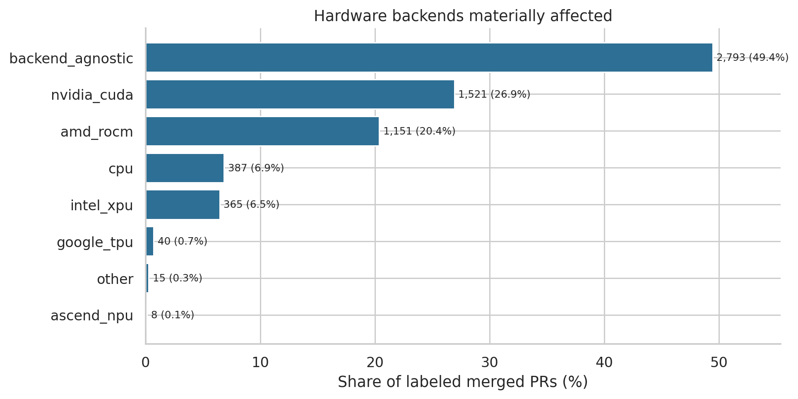

最常见的跨后端 pair 是 NVIDIA CUDA + AMD ROCm（380，6.73%），明显高于 NVIDIA +
XPU（95）、NVIDIA + CPU（90）、ROCm + XPU（90）和 ROCm + CPU（71）。这里的
“affected”包括 backend-specific build/test/CI/docs support，而不是“PR 在哪张卡上跑过”。
所以它直接回答 vLLM project 实际维护哪些硬件，却不能替代 RQ2 的 reproduction 配置。

## 7. Workload 的联合结构

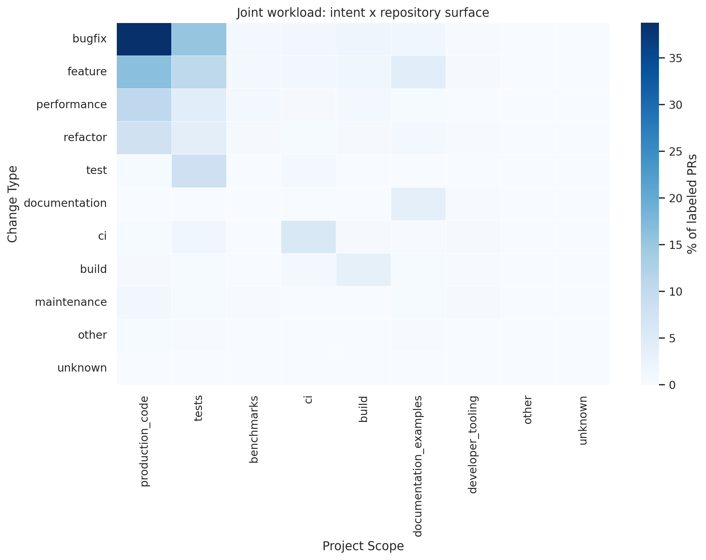

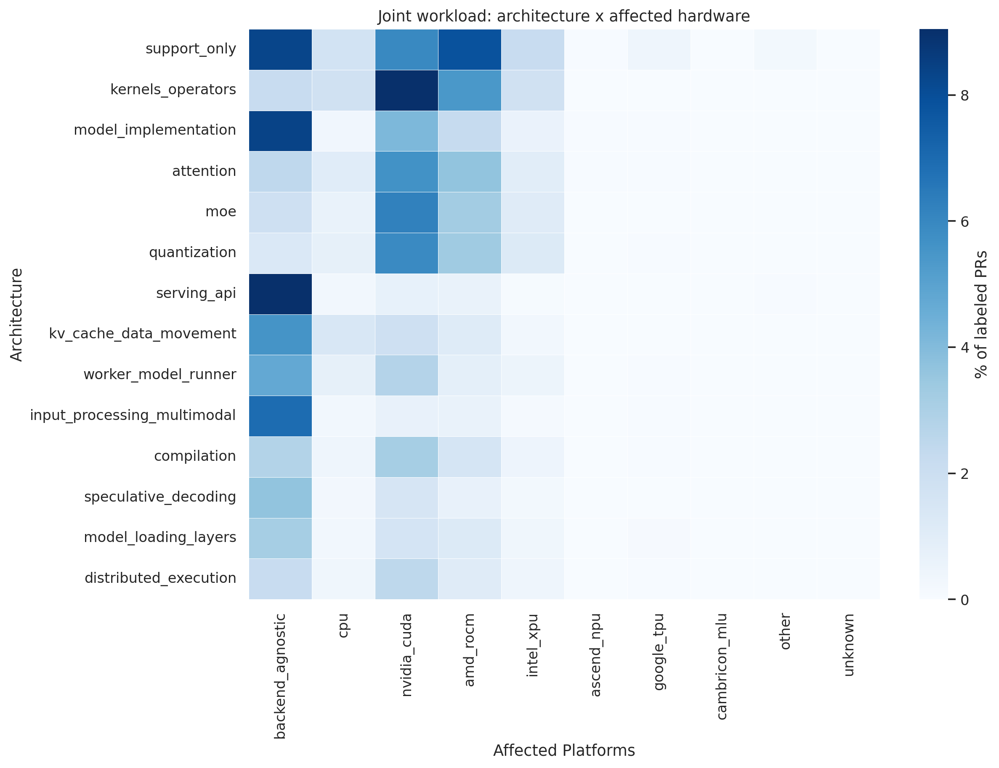

把 dominant intent、primary scope、architecture shape 与 hardware scope 组合后，头部
archetype 是：

| archetype | n | share | median churn | median files | median human reviews |
| --- | ---: | ---: | ---: | ---: | ---: |
| bugfix / production / multi-component / backend-specific | 449 | 7.95% | 32 | 2 | 3 |
| bugfix / production / multi-component / agnostic | 397 | 7.03% | 44 | 2 | 3 |
| feature / production / multi-component / backend-specific | 288 | 5.10% | 256.5 | 5 | 5.5 |
| performance / production / multi-component / backend-specific | 261 | 4.62% | 147 | 3 | 4 |
| test / tests / support-only / backend-specific | 254 | 4.50% | 13.5 | 1 | 2 |
| feature / production / multi-component / agnostic | 253 | 4.48% | 258 | 6 | 6 |
| bugfix / production / serving API / agnostic | 205 | 3.63% | 75 | 2 | 2 |
| CI / CI / support-only / backend-specific | 160 | 2.83% | 12 | 1 | 2 |

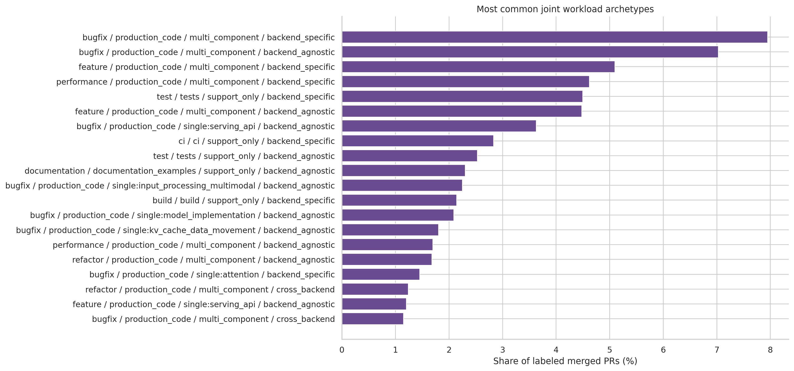

头部组合仍然只覆盖长尾的一部分；完整 deterministic signature 表保留了全部组合，未用
人为聚类把稀有硬件或组件并入“大类”。

## 8. 跨边界 work 的工程形态

Patch metrics 只作描述，不当作 effort 或难度的因果度量。但分层后的差异很大：

- 单 scope、单 component 的 bugfix：median churn 8.5、1 file、2 human reviews；同时
  跨 scope 和 component 的 bugfix：109.5、4 files、4 reviews。
- 单 scope、单 component 的 feature：23、1 file、2 reviews；同时跨两种边界的
  feature：427、8 files、7 reviews。
- 单 scope、单 component 的 performance PR：21、1 file、2 reviews；同时跨两种边界
  时为 377.5、6 files、6 reviews。

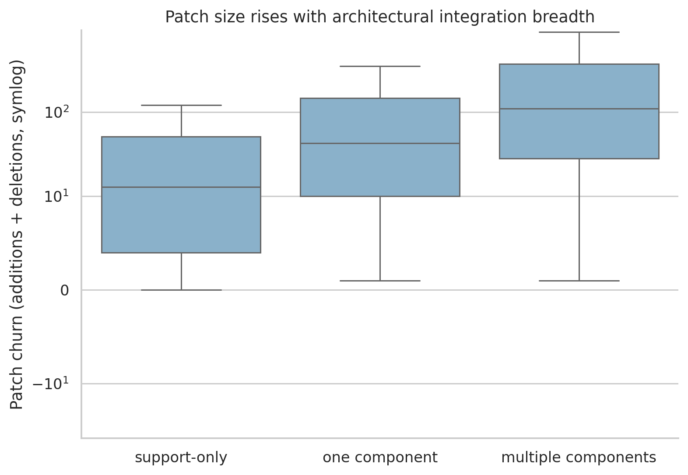

这些关联说明 RQ2 如果只挑“单文件 + 单 component + 现成 unit test”的 PR，会系统性
漏掉最能体现 AI-inference system integration 的 workload。它们不证明跨边界本身导致
更多 review，因为 intent、作者、patch size 等都可能共同变化。

## 9. 谁贡献了什么

在 5,649 个 core-labeled merged PR 中：

- external non-bot：3,404（60.26%）；
- snapshot write+：1,795（31.78%）；
- snapshot non-write：444（7.86%）；
- bot：6（0.11%）。

External PR 中 bugfix 44.2%、feature 20.8%、performance 11.5%，而 snapshot write+
分别为 34.8%、11.5%、11.3%；write+ 的 CI 占比更高（8.7% vs 3.6%）。Snapshot
non-write 的 test（19.6%）和 CI（16.7%）占比尤其高。

这说明“外部社区写功能、维护者只 Review”过于简单：外部作者确实贡献大部分 merged
work，write-capable 成员仍直接实现大量 bugfix/performance/CI，non-write roster 也大量
贡献 tests 与 CI。另一方面，全量 incoming PR 中 external share 更高，且 Review/merge
judgement 更集中；实现贡献与整合权力可以同时呈现不同分布。

2026 Jan–Jul，77 个 active snapshot reviewers 提交 19,091 次非 self-review；top 5
占 35.0%，top 10 占 52.7%，23 人覆盖 80%，Gini=0.6645。它支撑 RQ2 纳入 review 和
diagnosis task contract，但不是让 RQ1 的技术内容结论退化为 reviewer bottleneck。

## 10. 最终回答

vLLM 的真实工程 workload 可以表述为：

> 一个随贡献者池快速扩张的、以 bugfix 为最大但非多数的 AI-inference engineering
> portfolio；它同时包含 feature、performance、test、CI、build、docs 和 maintenance，
> 分布在从 serving/control plane 到 model/kernel/data plane 的多层架构，并且约一半明确
> 涉及一个或多个硬件后端。大量工作跨 project surface、production component 或 backend，
> 所以“理解系统边界与集成关系”是 workload 的结构属性，而不只是维护流程的困难。

这个结论自然连接 RQ2：benchmark 的 content coverage 必须覆盖上述联合 workload，
而 model capability coverage 应通过 diagnosis、implementation、review、revision、
performance engineering 等多种 task contract 来测量。Review 是其中重要的一类，但不是
唯一的故事。
