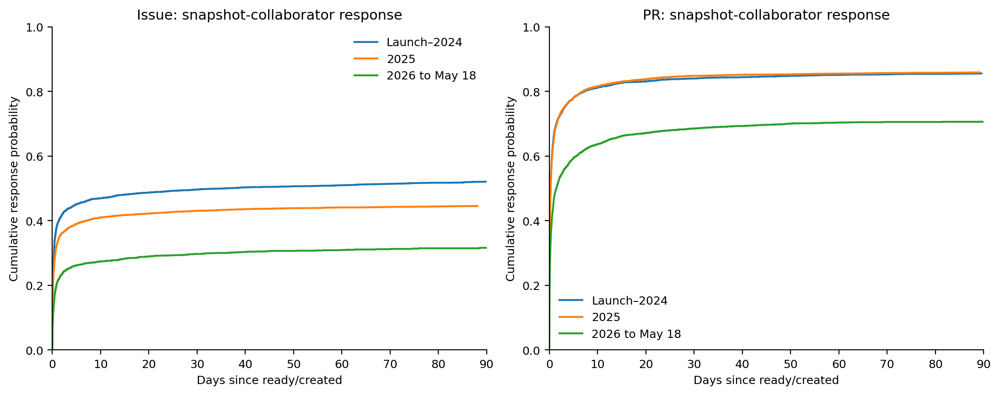
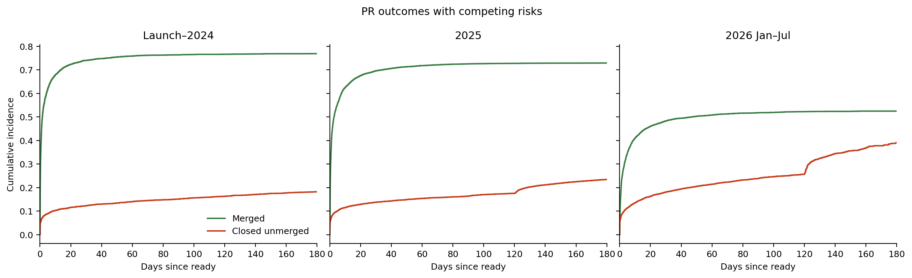
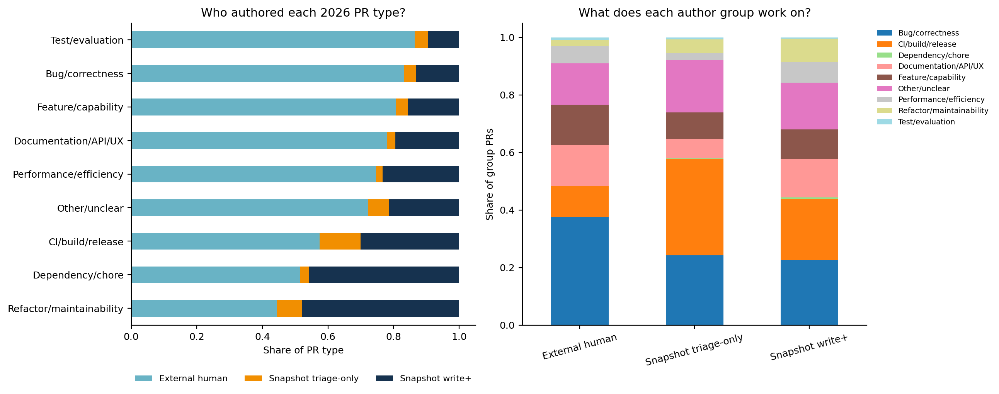
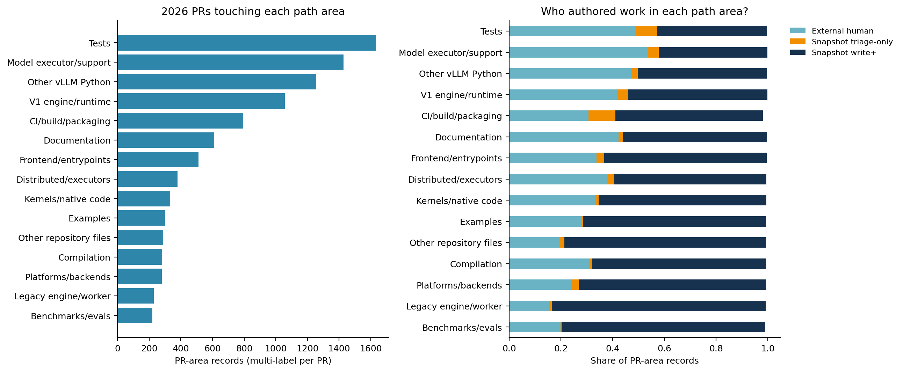
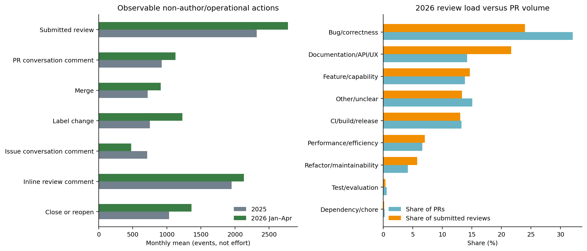
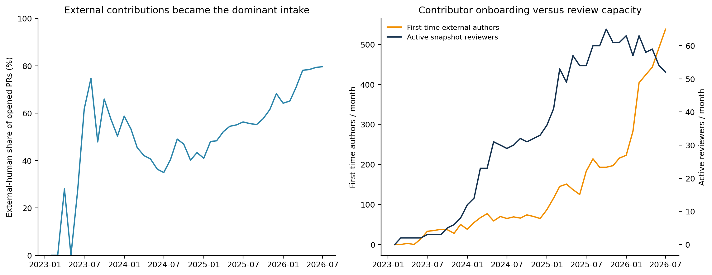
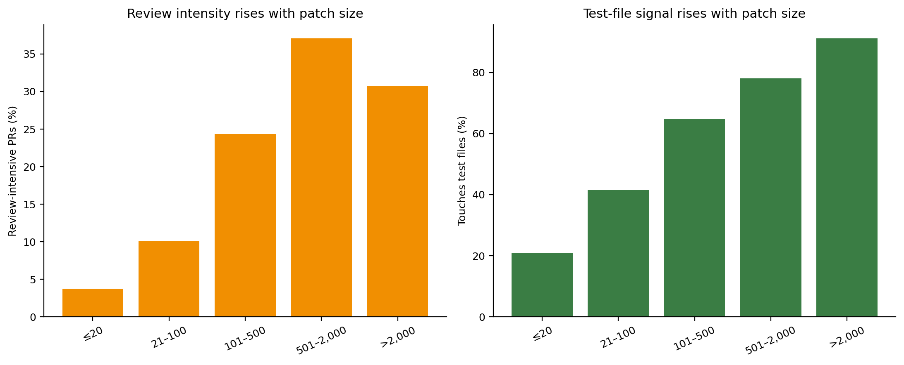

# RQ1 Findings: The vLLM Maintenance Workload

Snapshot cutoff: 2026-05-18

Status: reproducible quantitative census; content-validation and effort-calibration stages remain

Chinese version: [RQ1 研究结果：vLLM 的真实维护工作负载](RQ1_FINDINGS_ZH.md)

## Executive answer

vLLM is not simply receiving “more issues.” Its public maintenance system changed in three coupled ways: PR intake surged, the contributor population broadened, and the technical work shifted toward heterogeneous backends and inference-system internals. Observable review activity grew, but much more slowly than incoming PRs. The result is a large, mostly recent PR queue and a meaningful older issue queue.

The clearest comparison is between calendar year 2025 and the four complete months from January through April 2026:

| Monthly average | 2025 | 2026 Jan–Apr | Change |
| --- | ---: | ---: | ---: |
| Issues opened | 578.2 | 619.5 | +7% |
| PRs opened | 1,068.6 | 1,836.2 | +72% |
| PRs merged | 720.1 | 909.0 | +26% |
| Active snapshot-collaborator reviewers | 54.3 | 60.3 | +11% |
| Non-author collaborator review submissions | 2,316.7 | 2,778.3 | +20% |
| PR arrivals per active reviewer | 19.5 | 30.5 | +57% |
| Submitted reviews per opened PR | 2.17 | 1.55 | −29% |
| Inline review comments per opened PR | 1.83 | 1.20 | −35% |

The gap is visible in outcomes and in the queue. At the snapshot boundary, 1,994 issues and 3,037 PRs were open. Of the open issues, 1,396 (70.0%) had no observable response from anyone in the snapshot collaborator roster, 697 (35.0%) were older than 90 days, and only 10.0% had a current assignee. Of the open PRs, 2,266 (74.6%) had no submitted snapshot-collaborator review and 2,141 (70.5%) had at least one outstanding review request. These counts do not prove that every item deserved action, but they describe the operational queue much more directly than cumulative GitHub totals.

Responsiveness also fell. The seven-day response rate declined from 65.0% to 53.7% for issues and from 82.8% to 66.9% for ready PRs when any non-author human response is counted. Using the 2026 snapshot collaborator list, the corresponding rates fell from 46.1% to 27.2% for issues and from 79.9% to 62.2% for PRs.

Review burden is not confined to merged work. In the 2026 cohort, open and closed-unmerged PRs together absorbed 21.0% of non-author snapshot-collaborator reviews and 30.1% of inline review comments observed for that cohort. This is not “waste”: review can correctly reject, redirect, or improve a contribution. It does mean that counting merged PRs alone understates public review work.

The implementation and gatekeeping populations are also structurally different. External humans authored 71.7% of human PRs in 2026 and nearly four-fifths of bug and feature PRs. Current write-capable collaborators authored most refactors and dominated V1/runtime, platform, compilation, kernel, benchmark, and integration paths. Seventy-five snapshot collaborators submitted non-author reviews in 2026; just eight produced half of all review submissions. This combination—broad community implementation with concentrated integration and specialist review—is the central organizational fact the benchmark must preserve.

The engineering mix also changed. Among merged, human-authored PRs with commit data, the share with a hardware signal rose from 17.8% in the launch–2024 window to 36.8% in 2026. Across all PRs, the strongest recent topic signals include distributed/parallel execution (22.9%), attention and kernels (21.5%), KV cache/connectors/offload (13.3%), V1/model-runner work (13.1%), quantization (12.4%), multimodality (11.8%), and MoE/expert parallelism (11.3%). This directly supports strong heterogeneous-hardware and inference-runtime coverage in AI Infra Bench. The repository contains almost no MLU and very little Ascend/NPU work, however; those systems cannot be presented as representative of the observed vLLM distribution.

The benchmark implication is fundamental: one headline percentage cannot honestly cover implementation, diagnosis, triage, and review unless the benchmark constructs and weights those populations separately. PR-derived coding tasks estimate coverage of code-changing work with a reference solution. They do not estimate coverage of unanswered issues, reproduction work, architectural judgment, rejected contributions, or total maintainer time.

## 1. Data and estimands

The base source is Simon Mo's [*vLLM GitHub Gym: vLLM GitHub Snapshot (Fivetran)*](https://gist.github.com/simon-mo/2b0f4e9f872d479a08ae53edac51ecb1), SHA-256 `1992a9f7011ebe35ba6f62511d5ccc727b233e21d7279db3d3496f9f4892c44d`.

The canonical artifact census contains:

| Artifact | Count |
| --- | ---: |
| Issues | 15,571 |
| Pull requests | 26,768 |
| Top-level issue/PR comments | 178,352 |
| Submitted PR reviews | 114,154 |
| Inline review comments | 110,113 |
| Commits | 29,659 |
| Per-commit file changes | 405,311 |

An artifact is treated as a PR when it has a row in `pull_request`; otherwise it is an issue. This avoids one observed disagreement with the `issue.pull_request` flag.

The three reporting windows are:

1. repository launch through 2024;
2. calendar year 2025;
3. 2026 through May 18.

Monthly series are the primary longitudinal view. May 2026 is partial and is not used in the complete-month rate comparison above.

All variable definitions and classification precedence rules are frozen in the [RQ1 operational codebook](RQ1_CODEBOOK.md); the executable implementation is in `analysis/rq1/analyze.py`.

### What the analysis measures

- **Demand:** issue and PR arrivals.
- **Throughput:** human and bot closures, merges, and closed-unmerged PRs.
- **Responsiveness:** first non-author human response and first response from a user in the snapshot collaborator roster.
- **Review burden:** non-author review submissions, review rounds, review span, active reviewers, and concentration.
- **Work composition:** issue intent, PR work type, subsystem, hardware, and change shape.
- **Benchmark evidence:** merged human PRs, test-file signals, hardware requirements, review intensity, code-change size, and commit-reference links.

These are repository observables. They do not measure private discussion, active engineering hours, or response quality.

### Statistical interpretation

This snapshot is a census of the tables supplied, not a random sample of vLLM artifacts. Sampling-error intervals around raw monthly counts would therefore be artificial. Uncertainty enters through right-censoring, incomplete event/file coverage, historical-role ambiguity, and classification error. The analysis responds to those sources directly:

- fixed-horizon response denominators and Kaplan–Meier curves retain unresolved artifacts;
- cumulative-incidence curves treat merge and closed-unmerged as competing outcomes;
- file-derived results state their commit-coverage denominator and never use coverage-conditioned patch size to estimate merge probability;
- human-response results are primary, while snapshot-collaborator results are explicitly a role-roster sensitivity analysis;
- deterministic topic and workload labels remain provisional until a stratified, double-coded validation sample is complete.

Wilson intervals are shown for response proportions. They describe binomial precision conditional on the observed corpus, not uncertainty from missing GitHub activity or taxonomy error. The longitudinal comparisons are descriptive, not causal: this report does not infer burnout, contributor quality, or staffing adequacy.

## 2. Data-quality audit

The snapshot is rich enough for a full longitudinal study, but it is not analysis-ready without reconciliation.

| Audit finding | Count | Resolution |
| --- | ---: | --- |
| Issue/PR flag conflicts | 1 | Use existence in `pull_request` as canonical |
| Closed artifacts without close-history rows | 42 | Fall back to materialized `closed_at` |
| Current state versus latest history mismatch | 8 | Use materialized state at the snapshot boundary |
| Snapshot collaborators with triage or higher | 103 | Call them snapshot collaborators, not a historical roster |
| Snapshot collaborators with write or higher | 70 | Report separately where needed |
| Actors typed as bots | 10 | Exclude from human-response and review metrics |
| Submitted reviews missing `submitted_at` | 2 | Retain in PR-level burden; exclude from event-period ownership |

Commit-to-PR coverage is incomplete for open heads. It covers 74.5% of PRs in launch–2024, 69.3% in 2025, and 47.6% in 2026. Therefore file, churn, and test-touch statistics are calculated on PRs with commit data, and the benchmark-eligible analysis is restricted to merged human PRs with commit data.

This missingness is outcome-related: merged commits are more likely to be present than open PR heads. Consequently, patch-size and changed-file fields are **not** used to estimate merge probability. Doing so would condition the outcome comparison on a post-intake coverage mechanism and produce strongly inflated merge rates.

`issue_referenced` captures commits that reference an issue, not all PR-body links or cross-reference events. The observed issue↔PR link rate is consequently a lower bound and must not be interpreted as the true rate at which issues lead to code changes.

The PR census captures almost all post-launch default-branch change flow. There are 87 `main`-branch commits without a `commit_pull_request` mapping: 81 in 2023, three in 2024, two in 2025, and one in 2026. Thus direct/unmapped commits are an important launch-history caveat but not a large omitted contemporary workload stream in this snapshot.

Current assignments come from `issue_assignee`. Outstanding review requests are reconstructed from the last add/remove event for each PR–reviewer pair. Latest approval and change-request counts are descriptive only: an approval may target an earlier head, and the snapshot does not provide a complete review-thread resolution model.

## 3. Demand, throughput, and backlog

PR demand changed much faster than issue demand. The 2026 January–April monthly average was 72% above 2025 for PR arrivals, while merge throughput was only 26% higher. Issue arrivals rose 7%.

The PR backlog consequently accelerated from 1,296 at the end of December 2025 to 2,779 at the end of April 2026 and 3,037 at the May 18 snapshot. The issue backlog was 1,791 at the end of 2025, 1,936 at the end of April, and 1,994 at the snapshot.

### Backlog age at the snapshot

| Age | Open issues | Share | Open PRs | Share |
| --- | ---: | ---: | ---: | ---: |
| ≤30 days | 477 | 23.9% | 1,067 | 35.1% |
| 31–90 days | 820 | 41.1% | 1,304 | 42.9% |
| 91–180 days | 438 | 22.0% | 503 | 16.6% |
| >180 days | 259 | 13.0% | 163 | 5.4% |

Most of the PR backlog is recent, consistent with an intake surge rather than only a permanent stock of old PRs. The issue backlog is older: 35.0% was more than 90 days old.

### The current operational queue

Backlog age alone does not show what a maintainer encounters. The snapshot queue adds response, assignment, review, and process-state signals.

| Queue signal at 2026-05-18 | Count | Share of queue |
| --- | ---: | ---: |
| Open issues | 1,994 | 100% |
| Open issues with no non-author human response | 608 | 30.5% |
| Open issues with no snapshot-collaborator response | 1,396 | 70.0% |
| Open issues older than 90 days | 697 | 35.0% |
| Open issues >90d with no collaborator response | 402 | 20.2% |
| Open issues with a current assignee | 200 | 10.0% |
| Open PRs | 3,037 | 100% |
| Open PRs still marked draft | 579 | 19.1% |
| Open PRs with no collaborator response | 2,086 | 68.7% |
| Open PRs with no submitted collaborator review | 2,266 | 74.6% |
| Open PRs with an outstanding review request | 2,141 | 70.5% |
| Open PRs labeled rebase/conflict | 475 | 15.6% |
| Open PRs labeled stale | 201 | 6.6% |

Bug/correctness dominates both queues: 1,101 open issues (55.2% of open issues) and 991 open PRs (32.6% of open PRs). Feature/model/backend requests add 337 open issues, while feature/capability contributes 563 open PRs. Design/RFC issues have the oldest median age among the large issue categories (95.5 days), which is consistent with long-lived design discussion but not evidence that the queue is healthy or unhealthy.

These state signals must not be summed into a single “staleness score.” Draft PRs, requested reviews, requested changes, conflicts, and unanswered reports imply different actions and different benchmark contracts. They are most useful for constructing diagnosis, review, and maintainer-triage samples that a merged-PR benchmark would otherwise omit.

### Closure is not the same as resolution

Across the snapshot, issue state reasons include 7,766 `completed`, 5,705 `not_planned`, 106 `duplicate`, and 37 `reopened`. Among issue close events, bots accounted for 19.0% in the launch–2024 window, 46.6% in 2025, and 45.1% in 2026. The large backlog reductions around November 2024 and several later months therefore include automated lifecycle management, not only solved engineering work.

For RQ1, report human closures, bot closures, `completed`, and `not_planned` separately. A closed-issue count is not a valid proxy for maintainer engineering throughput.

Age-matched 90-day disposition reinforces the distinction. Among 2026 issues old enough for 90 days of observation, 51.1% of bug reports were currently marked completed and had closed within 90 days, compared with 28.2% of feature/model/backend requests, 19.2% of performance issues, 15.4% of design/RFC issues, and 25.0% of usage issues. These are final-snapshot disposition signals rather than causal resolution rates: reopened items and later reclassification can change the current state reason. They nevertheless show why issue categories need different outcome definitions.

## 4. Responsiveness

Fixed-horizon rates avoid comparing only artifacts that eventually received a response. Each denominator includes every artifact old enough to have been observed for the stated horizon. Wilson 95% confidence intervals are reported below.

### Seven-day response

| Artifact and responder | Launch–2024 | 2025 | 2026 through May 18 |
| --- | ---: | ---: | ---: |
| Issue, any human | 65.0% [63.8, 66.2] | 59.1% [57.9, 60.3] | 53.7% [51.8, 55.6] |
| Issue, snapshot collaborator | 46.1% [44.8, 47.4] | 40.0% [38.9, 41.2] | 27.2% [25.6, 28.9] |
| PR, any human | 82.8% [81.7, 83.8] | 82.5% [81.9, 83.2] | 66.9% [65.9, 68.0] |
| PR, snapshot collaborator | 79.9% [78.7, 80.9] | 80.0% [79.3, 80.8] | 62.2% [61.1, 63.3] |

The drop is not an artifact of excluding unresolved items; the time-to-event curves preserve right-censored observations.

The snapshot collaborator roster is a role snapshot, not a historical membership table. The absolute collaborator-response levels should therefore be treated as a sensitivity analysis. The any-human trend is not affected by this role limitation.

Author role matters. External humans authored 83.4% of 2026 issues and 71.5% of 2026 PRs. For 2026 external-human artifacts, seven-day any-human response was 56.5% for issues and 60.7% for ready PRs; snapshot-collaborator response was 28.5% and 55.0%, respectively. The all-PR rate is higher partly because collaborator-authored PRs receive faster review. A public benchmark claiming to represent community support should therefore preserve author role as a sampling and reporting stratum.

Conversation response and code review are not the same. The probability of a non-author submitted snapshot-collaborator review within seven days was 72.1% in launch–2024, 73.8% in 2025, and 55.0% in 2026. For the 2026 cohort, it reached 59.8% by 14 days and 64.0% by 30 days. Seven-day submitted-review rates were 67.0% for refactors, 62.7% for CI/build, 51.7% for bugs, 51.6% for performance work, and 50.1% for features. These figures exclude PR-author self-reviews and author replies.

### Which issues receive slower collaborator response?

In 2026, the seven-day snapshot-collaborator response rate varied materially by issue intent:

| Issue intent | Seven-day collaborator response |
| --- | ---: |
| CI/infrastructure | 11.5% |
| Other/tracking | 18.7% |
| Installation/build | 20.0% |
| Performance | 25.7% |
| Bug/correctness | 26.9% |
| Documentation/API | 32.0% |
| Feature/model/backend request | 33.2% |
| Usage/configuration | 33.6% |
| Design/RFC | 50.7% |

This does not mean that RFCs are easier. They are more likely to attract discussion, while bug and performance reports can require reproduction before a useful answer. A future content-analysis sample must separately annotate acknowledgement, request for information, diagnosis, design discussion, and resolution. Comment existence alone cannot measure substantive help.

## 5. What users ask for

Issue titles and current labels provide a high-coverage deterministic intent taxonomy, especially after issue forms became standardized.

| Issue intent | 2025 | 2026 through May 18 |
| --- | ---: | ---: |
| Bug/correctness | 55.2% | 56.1% |
| Feature/model/backend request | 16.3% | 13.2% |
| Usage/configuration | 13.0% | 4.0% |
| CI/infrastructure | 2.5% | 9.3% |
| Design/RFC | 3.5% | 5.6% |
| Performance | 3.0% | 2.7% |
| Installation/build | 2.8% | 2.0% |
| Documentation/API | 2.0% | 1.0% |
| Other/tracking | 1.6% | 6.1% |

Bug/correctness is the dominant incoming issue workload. CI/infrastructure issues grew sharply in 2026. Some apparent shifts, especially usage and other/tracking, can reflect issue-template and labeling changes, so the taxonomy needs a manually coded gold sample before publication-level trend claims.

Classification provenance makes this limitation measurable. In 2026, 93.9% of issues receive their intent from an explicit title tag or current label, while 6.1% remain the default other/tracking category. Coverage was only 68.0% explicit in launch–2024, so early-versus-late category shifts are partly entangled with issue-form adoption.

For the benchmark, issue workload suggests two task families that PR-only sampling misses:

- **diagnosis/reproduction tasks** from bug, performance, installation, and CI issues;
- **triage/design tasks** from feature requests and RFCs.

They should be reported separately from implementation tasks because their verifiers and target outputs differ.

## 6. PR work and lifecycle

The provisional rule-based PR taxonomy uses title tags, labels, verbs, and changed-file paths. `Other/unclear` remains explicit rather than forcing uncertain assignments.

| PR work type | 2025 | 2026 through May 18 |
| --- | ---: | ---: |
| Bug/correctness | 22.9% | 32.0% |
| CI/build/release | 16.5% | 13.2% |
| Documentation/API/UX | 20.0% | 14.2% |
| Feature/capability | 13.8% | 13.8% |
| Performance/efficiency | 5.5% | 6.6% |
| Refactor/maintainability | 3.6% | 4.2% |
| Test/evaluation as primary intent | 0.5% | 0.6% |
| Dependency/chore | 0.5% | 0.3% |
| Other/unclear | 16.7% | 15.1% |

Test/evaluation is rare as a primary PR intent, but tests are commonly modified inside bug, feature, refactor, and hardware PRs. A benchmark taxonomy should therefore keep **work intent** separate from the **test/verifier signal**.

For 2026 PRs, 58.5% of assignments use a class-specific title tag/current label, 26.4% use a lexical heuristic, and 15.1% remain other/unclear. Those are provenance categories, not calibrated confidence scores. The unresolved and heuristic strata must be oversampled in human validation; otherwise aggregate precision can hide poor performance exactly where benchmark quotas are most uncertain.

### Competing PR outcomes

Merge and close-without-merge are competing outcomes. Treating closed-unmerged PRs as ordinary censoring would overstate merge probability.

| Cohort | Merged by 30d | Closed unmerged by 30d | Merged by 90d | Closed unmerged by 90d |
| --- | ---: | ---: | ---: | ---: |
| Launch–2024 | 74.0% | 12.3% | 76.4% | 15.1% |
| 2025 | 69.6% | 13.8% | 72.6% | 16.3% |
| 2026 through May 18 | 50.5% | 18.0% | 53.8% | 21.8% |

Within the 2026 cohort old enough for 90-day observation, provisional work types have different merge incidence: refactor/maintainability 81.7%, CI/build/release 74.1%, performance 65.8%, bug/correctness 60.5%, and feature/capability 56.1%. These are associations, not intrinsic difficulty estimates; author role, scope, and censoring structure differ across categories.

## 7. Who authors what engineering work?

“Committer” is ambiguous in a GitHub repository. The SQLite `commit` table contains 29,659 commits, 2,733 distinct author-email strings, but only 117 distinct committer-email strings; author and committer email match on 11,053 commits. Squash, merge, and automation mechanics therefore make git `committer` metadata a poor measure of the person who did the engineering. This report uses:

- **PR author** for code-change ownership;
- **merge actor** for final integration gatekeeping;
- **non-author reviewer/commenter** for review and triage work;
- **snapshot write+** and **snapshot triage-only** only as current-role sensitivity groups, never as historical permissions.

Of the 8,532 human-authored PRs created in 2026 through May 18, 6,117 (71.7%) came from external humans, 1,997 (23.4%) from users currently holding write permission, and 418 (4.9%) from current triage-only collaborators. The small difference from the 71.5% all-PR external share is the exclusion of 19 bot-authored PRs.

### Work type and author role are not interchangeable

| 2026 PR type | External humans | Snapshot triage-only | Snapshot write+ |
| --- | ---: | ---: | ---: |
| Bug/correctness | 79.4% | 4.2% | 16.4% |
| Feature/capability | 78.1% | 3.1% | 18.8% |
| Documentation/API/UX | 75.4% | 2.3% | 22.3% |
| Performance/efficiency | 72.5% | 1.4% | 26.1% |
| CI/build/release | 52.5% | 13.5% | 34.0% |
| Refactor/maintainability | 41.4% | 6.8% | 51.8% |
| Test/evaluation as primary intent | 84.3% | 0.0% | 15.7% |

The community is the dominant source of user-facing demand response: external contributors authored nearly four-fifths of bug and feature PRs. Core engineering is different. Current write+ contributors authored most refactors and a disproportionate share of CI/build, performance, and unclear cross-cutting work.

The internal portfolio also changed. From 2025 to 2026, refactor/maintainability rose from 5.2% to 9.2% of write+ PRs and performance from 5.0% to 7.4%, while documentation/API fell from 18.3% to 13.5%. In the external portfolio, bug/correctness rose from 23.9% to 35.6%. The aggregate shift toward bug-fix PRs is therefore largely a change in community intake, while the core portfolio shifted toward refactoring and performance.

The external/core outcome difference is not explained away by this coarse work-type mix. Among 2026 PRs old enough for 90-day follow-up, external versus current write+ merge incidence was 49.0% versus 88.0% for bugs, 46.5% versus 86.2% for features, 50.5% versus 92.7% for performance, 55.3% versus 92.4% for refactors, 61.8% versus 86.3% for CI/build, and 51.9% versus 95.9% for documentation/API. This within-stratum persistence strengthens the conclusion that the streams operate differently, but it remains non-causal: the taxonomy is coarse, task scope and contributor experience differ, and current permission may reflect successful prior contribution rather than status at PR creation.

This distinction matters for the benchmark. A proportional sample of all PRs will mostly test whether agents can address community-facing bugs and features. It will underrepresent the system-internal refactoring, integration, and architectural work disproportionately performed by core contributors unless author role is an explicit secondary stratum.

### Technical ownership differs even more than PR type

The 2026 share authored by current write+ contributors rises as work moves deeper into the runtime:

| Technical signal | External | Triage-only | Write+ |
| --- | ---: | ---: | ---: |
| Frontend/API subsystem | 64.8% | 3.6% | 31.5% |
| Kernels/operators | 64.1% | 5.6% | 30.3% |
| Distributed serving | 57.5% | 4.4% | 38.1% |
| Model support | 54.9% | 4.0% | 41.1% |
| Tests/evaluation paths | 50.6% | 8.0% | 41.4% |
| Engine/scheduler | 35.6% | 1.8% | 62.5% |
| V1 engine/model runner topic | 41.9% | 4.8% | 53.3% |
| Disaggregated serving topic | 24.4% | 0.0% | 75.6% |

Hardware ownership is ecosystem-dependent. External humans authored 65.2% of CUDA-signal PRs, 57.6% of ROCm, 56.1% of XPU, and 65.6% of CPU work. Current write+ contributors authored 39.4% of cross-backend work and 43.0% of XPU work. The 76.0% write+ share for NPU and 57.9% for TPU are based on much smaller samples and must not be generalized.

### Concrete code-path hotspots

Path analysis is restricted to PRs with commit/file data. A PR can touch multiple path areas.

| 2026 path area | PRs touching area | External | Triage-only | Write+ |
| --- | ---: | ---: | ---: | ---: |
| Tests | 1,637 | 48.9% | 8.4% | 42.4% |
| Model executor/support | 1,429 | 53.6% | 4.3% | 42.0% |
| Other vLLM Python | 1,260 | 47.0% | 2.7% | 50.0% |
| V1 engine/runtime | 1,059 | 41.7% | 4.2% | 53.8% |
| CI/build/packaging | 809 | 30.7% | 10.5% | 57.0% |
| Frontend/entrypoints | 514 | 33.9% | 2.9% | 62.8% |
| Distributed/executors | 382 | 37.7% | 2.9% | 58.9% |
| Kernels/native code | 335 | 33.4% | 1.2% | 64.8% |
| Compilation | 284 | 31.0% | 1.1% | 67.3% |
| Platforms/backends | 282 | 23.8% | 3.2% | 72.3% |
| Benchmarks/evals | 222 | 19.8% | 0.5% | 78.8% |

This exposes an important distinction hidden by title taxonomy: external contributors generate most incoming PRs, but current collaborators dominate the executable infrastructure used to validate and integrate them—benchmarks/evals, platforms, compilation, native kernels, distributed executors, and CI/build. An agent benchmark that selects tasks only where a simple unit test already exists will disproportionately sample the community-facing side and miss much of the environment-building work.

### Engineering ownership is broad overall but narrow in specialties

Among current write+ authors in 2026, 55 people authored 1,997 PRs. The top author contributed 8.7%, the top five 32.5%; ten authors produced half and 21 produced 80%. That aggregate breadth masks specialization:

- the top five authored 63.0% of write+ refactors and 62.2% of performance PRs, versus 31.8% of bug PRs;
- the top five authored 71.4% of write+ XPU work, 63.8% of cross-backend work, and 56.5% of CUDA work;
- the top five authored 71.4% of LoRA/adapters, 68.8% of compilation/CUDA-graph, 68.6% of disaggregated-serving, and 68.6% of MoE/expert-parallel work;
- at the path level, the top five current collaborators authored 73.9% of benchmark/eval PR-area records, 72.2% of compilation, and 69.2% of kernel/native-code records.

These are dependency signals, not criticism of individual contributors. They show where task construction and verification will require scarce domain experts. Rare-topic benchmark tasks should be reviewed by the relevant specialists, and the project should not assume that any maintainer can validate any accelerator or runtime task interchangeably.

### Merge authority is even more concentrated

All 2025 and 2026 merges in the snapshot were performed by users currently in the write+ roster; only three launch–2024 merges fall outside it. In 2026, the top five merge actors integrated 48.7% of bug PRs, 58.0% of CI/build, 61.3% of documentation/API, and 65.1% of refactors. Only 7.9% of merged bug PRs and 8.2% of performance PRs were merged by their own author, compared with 26.6% of refactors.

Merge-actor concentration captures final gatekeeping, not the full decision process. A merge actor may press the button after others review, and current permission cannot establish historical authority. Still, it confirms that contribution volume and integration authority are separate systems.

## 8. What maintainers visibly do

Repository events expose several distinct maintenance actions. They are reported separately because an inline review, a label change, and a merge do not represent equal effort.

| Snapshot-collaborator action, monthly mean | 2025 | 2026 Jan–Apr | Change |
| --- | ---: | ---: | ---: |
| Non-author submitted reviews | 2,316.7 | 2,778.3 | +19.9% |
| Non-author inline review comments | 1,949.3 | 2,132.3 | +9.4% |
| Non-author PR conversation comments | 926.1 | 1,125.3 | +21.5% |
| Non-author issue conversation comments | 710.4 | 476.8 | −32.9% |
| Label changes | 750.7 | 1,229.8 | +63.8% |
| Close/reopen events | 1,033.0 | 1,362.8 | +31.9% |
| Merges | 720.1 | 909.0 | +26.2% |

The central comparison is not that maintainers became less active. Every visible PR-facing action increased, and label and lifecycle activity increased sharply. Rather, PR intake grew 71.8% while non-author submitted reviews grew 19.9% and inline comments grew 9.4%. The observable review interaction available per incoming PR therefore fell. Non-author issue conversation comments declined 32.9% while issue intake rose 7.1%.

This event decomposition still omits code written inside maintainer-authored PRs, reading without commenting, reproduction, profiling, meetings, and private chat. It is a public-workflow description, not a timesheet.

The capacity conclusion is robust to simple activity thresholds. The monthly mean number of snapshot collaborators with at least one observable non-author/operational action was 65.9 in 2025 and 68.2 in 2026 Jan–Apr; with at least five actions, 54.0 and 57.2; active on at least three distinct days, 53.3 and 56.8. The visible active pool grew only modestly. Observable reviewer-days grew 21.2%, from 560.6 to 679.5 per month—still far below the 71.8% increase in PR intake. Meanwhile, the median heterogeneous event count per active collaborator rose from 34.6 to 64.5 per month, and the 90th percentile rose from 329.1 to 369.9. Event counts and active days remain incomparable to hours, but these sensitivity checks rule out an apparent capacity trend caused solely by a one-event activity threshold.

Work remains concentrated by action. In 2026, the top five snapshot collaborators performed 39.7% of non-author submitted reviews, 39.0% of inline comments, 49.9% of merges, 41.4% of non-author issue conversation comments, and 46.8% of close/reopen events. These aggregate statistics intentionally do not identify or rank individuals.

### Maintainer portfolios and expertise bottlenecks

The current roster contains 103 users with triage permission or higher. In the 2026 observation window, 69 (67.0%) both authored a PR and performed at least one observable gatekeeping action (review, issue response, or merge), five (4.9%) only authored PRs, nine (8.7%) only gatekept, and 20 (19.4%) had no observed public action of those kinds. This is a snapshot-roster overlap analysis, not proof that the last group was inactive: membership intervals, private work, issue operations other than responses, and work in other repositories are unavailable.

Review is broad across coarse work types but narrow inside technical specialties. The 75 active snapshot reviewers in 2026 had a median of six distinct PR work types; the median reviewer still placed 38.7% of submissions in one primary type. At the corpus level, eight reviewers produced half of all 12,506 time-stamped non-author review submissions and 21 produced 80%. Topic-level top-five shares were 62.1% for multimodal/audio, 61.8% for frontend/API, 58.8% for model support, 55.3% for LoRA/adapters, 54.8% for MoE/expert parallelism, 53.6% for quantization, and 52.6% for compilation/CUDA graphs. These overlapping heuristic topic signals do not prove expertise, but they identify domains where verification capacity is plausibly scarce and should be checked with CODEOWNERS and maintainers.

Engineering and review concentration should not be read as a leaderboard or as evidence of unhealthy project structure. They answer a benchmark-design question: which task strata can be validated by a broad reviewer pool, and which require a small set of domain experts whose time must be budgeted explicitly?

### Review spent beyond merged PRs

| 2026 cohort outcome at snapshot | PRs | PRs with a collaborator review | Submitted reviews | Share of reviews | Inline comments | Share of inline comments |
| --- | ---: | ---: | ---: | ---: | ---: | ---: |
| Merged | 3,943 | 96.7% | 9,165 | 79.0% | 6,003 | 69.9% |
| Closed unmerged | 1,856 | 20.6% | 837 | 7.2% | 837 | 9.7% |
| Still open | 2,752 | 23.0% | 1,601 | 13.8% | 1,752 | 20.4% |

Open and closed-unmerged PRs together account for 21.0% of non-author submitted reviews and 30.1% of non-author inline comments in the 2026 cohort. This is exactly the review population excluded by a benchmark derived only from merged patches. A review track should deliberately sample accepted, rejected, redirected, and still-contested changes.

Review burden also differs from PR-count share. In 2026, documentation/API/UX represented 14.2% of PRs but 21.6% of non-author submitted reviews and 29.0% of non-author inline comments. Refactors represented 4.2% of PRs but 5.8% of review submissions. Bug/correctness represented 32.0% of PRs but 24.0% of review submissions. These are workload-composition differences, not direct time estimates.

## 9. Contributor intake, experience, and review capacity

The share of PRs authored by users outside the snapshot collaborator roster rose from 43.6% in launch–2024 to 55.7% in 2025 and 71.5% in 2026. Excluding bots, external humans authored 6,117 of 8,532 PRs (71.7%) in 2026. There were 1,957 first-time external PR authors in all of 2025 and 1,575 by May 18, 2026.

Among cohorts with 90 days of follow-up, external-human PRs merged within 90 days at 60.6% in launch–2024 and 60.7% in 2025, falling to 51.7% in the observable 2026 cohort. Snapshot-collaborator-authored PRs remained around 87–89%. The 2026 comparison uses only PRs old enough for a full 90-day outcome; it does not treat newer PRs as failures. The role gap still must not be interpreted as contributor quality: work type, task scope, prior contributor experience, and selection into review differ.

### Most external authors contribute once, but repeat authors supply most PRs

The external stream is not one homogeneous crowd. Among the 2,105 external humans who opened a PR in 2026 through May 18, 1,188 (56.4%) opened one PR in the period, 616 (29.3%) opened two to four, and 301 (14.3%) opened five or more. The last group supplied 54.6% of all external PRs, while one-PR contributors supplied 19.4%. This means maintainers face both high onboarding breadth and a smaller repeat-contributor production stream.

PR-level experience is associated with markedly different observable outcomes:

| 2026 external PR experience | PRs | Share of external PRs | Collaborator response by 7d | Reviewed by collaborator | Merged by 90d |
| --- | ---: | ---: | ---: | ---: | ---: |
| First observed PR | 1,575 | 25.7% | 43.3% | 37.0% | 40.1% |
| 2nd–5th observed PR | 1,851 | 30.3% | 54.5% | 46.7% | 45.6% |
| 6th+ observed PR | 2,691 | 44.0% | 62.5% | 57.4% | 63.4% |

These are descriptive associations, not evidence that maintainers favor familiar people or that first-time contributions are worse. Repeated contributors are selected by prior experience and may choose different work. The type mix supports that caution: 38.8% of first PRs were classified as bugs and 19.2% as documentation/API, versus 32.8% and 11.7% among sixth-or-later PRs. A causal analysis would need task controls and a historical membership model.

The lifecycle still quantifies a real interface cost. First PRs accounted for one quarter of recent external intake and had the lowest observed response and review coverage. Of first-time external authors with complete follow-up, 33.9% of the launch–2024 cohort, 41.2% of the 2025 cohort, and 46.9% of the eligible early-2026 cohort submitted a second PR within 90 days. The last estimate covers only 390 early-2026 authors and should not be extrapolated to the full partial-year cohort.

For the benchmark, first-time and repeat-contributor work should be retained as a secondary stratum. Tasks derived only from frequently contributing authors will overstate repository familiarity and underrepresent onboarding, problem clarification, environment setup, and patch-shaping work. Conversely, a sample dominated by one-off PRs will miss the larger share of external patches actually produced by repeat contributors.

The mean number of active snapshot-collaborator reviewers rose from 54.3 in 2025 to 60.3 in early 2026, while PR arrivals per reviewer rose from 19.5 to 30.5 per month. Non-author review submissions increased, but far less quickly than PR arrivals.

Review work is distributed across more people than in the early project, but remains concentrated:

| Period | Active snapshot reviewers | Submitted reviews | Top-five share | Gini |
| --- | ---: | ---: | ---: | ---: |
| Launch–2024 | 56 | 10,222 | 49.9% | 0.734 |
| 2025 | 89 | 27,800 | 43.6% | 0.749 |
| 2026 through May 18 | 75 | 12,506 | 39.7% | 0.688 |

Counts and concentration quantify observable review burden, not review effort. Reading, reproducing, profiling, offline discussion, and design work are not recoverable from GitHub. A small maintainer calibration study remains necessary if the project wants effort-weighted coverage.

## 10. Technical workload: inference topics, subsystems, and hardware

The broad subsystem taxonomy is useful for benchmark coverage, but vLLM maintainers work on more specific inference concerns. A second multi-label taxonomy uses titles, labels, and available paths to expose those concerns.

| Engineering topic signal | 2025 | 2026 through May 18 | Change |
| --- | ---: | ---: | ---: |
| Distributed and parallelism | 28.5% | 22.9% | −5.6 pp |
| Attention and kernels | 19.6% | 21.5% | +1.9 pp |
| Frontend, serving, and APIs | 18.9% | 16.4% | −2.5 pp |
| Model support | 17.3% | 13.7% | −3.6 pp |
| KV cache, connectors, and offload | 8.8% | 13.3% | +4.5 pp |
| V1 engine and model runner | 16.8% | 13.1% | −3.8 pp |
| Quantization and low precision | 10.8% | 12.4% | +1.6 pp |
| Multimodal and audio | 12.2% | 11.8% | −0.4 pp |
| MoE and expert parallelism | 8.8% | 11.3% | +2.5 pp |
| Speculative decoding | 7.8% | 9.7% | +2.0 pp |
| Structured output, tools, reasoning | 8.0% | 9.2% | +1.2 pp |
| torch.compile and CUDA graphs | 4.1% | 5.8% | +1.7 pp |
| Disaggregated serving | 1.1% | 1.8% | +0.8 pp |

The largest positive change is KV cache/connectors/offload, followed by MoE, speculative decoding, attention/kernels, and compilation/CUDA-graph work. PRs opened in the 2026 cohort received 4,918 submitted snapshot-collaborator reviews on distributed/parallel work; attention/kernel PRs received 3,501; model-support PRs 2,990; V1/model-runner PRs 2,789; and KV-cache/connectors/offload PRs 1,916 by the cutoff. These are PR-creation-cohort totals rather than review-event-period totals; the multi-label signals overlap and must not be added.

Topic detection is provisional and more sensitive to missing paths than title-level work-type classification. The report uses it to identify benchmark coverage needs, not to claim a precise causal shift in engineering priorities.

### Broad subsystems and heterogeneous hardware

The following shares use the benchmark-source frame: merged, human-authored PRs with commit data. Dimensions are multi-label, so rows do not sum to 100%.

| Subsystem signal | Launch–2024 | 2025 | 2026 through May 18 |
| --- | ---: | ---: | ---: |
| Distributed serving | 40.9% | 38.8% | 43.4% |
| Tests/evaluation paths | 37.8% | 38.3% | 42.7% |
| Kernels/operators | 23.4% | 28.6% | 34.2% |
| Model support | 24.7% | 22.5% | 23.6% |
| Platform/build/CI | 26.1% | 22.0% | 21.0% |
| Frontend/API | 18.5% | 17.5% | 18.9% |
| Memory/KV cache | 5.3% | 9.0% | 12.7% |
| Engine/scheduler | 17.7% | 11.3% | 8.3% |

| Hardware signal | Launch–2024 | 2025 | 2026 through May 18 |
| --- | ---: | ---: | ---: |
| NVIDIA/CUDA | 8.1% | 11.3% | 15.8% |
| AMD/ROCm | 6.2% | 10.7% | 19.6% |
| CPU | 5.0% | 6.0% | 9.1% |
| Intel/XPU | 2.1% | 2.9% | 6.2% |
| TPU | 3.2% | 6.3% | 1.6% |
| Ascend/NPU | 0.0% | 0.2% | 0.4% |
| MLU | 0.0% | <0.1% | 0.0% |
| Cross-backend | 3.1% | 4.8% | 7.3% |
| No detected hardware signal | 82.2% | 73.1% | 63.2% |

This is the strongest empirical justification for a hardware-aware AI-inference benchmark. Kernels, KV cache, ROCm, CUDA, XPU, CPU, and cross-backend changes are becoming a larger share of merged maintenance work.

It also establishes a boundary: Ascend/NPU and MLU cannot be assigned large representative weights from this vLLM snapshot. If the benchmark includes them because maintainers consider them strategically important, report them as a **targeted heterogeneous-system stress track** or augment RQ1 with repositories where that work actually occurs.

## 11. Benchmark source population and verifier reality

The snapshot contains 16,627 merged, human-authored PRs with commit data:

| Source period | PRs in source frame | Tests touched | Hardware signal | Performance intent | Large change | Review-intensive |
| --- | ---: | ---: | ---: | ---: | ---: | ---: |
| Launch–2024 | 3,944 | 33.3% | 17.8% | 1.8% | 9.9% | 13.1% |
| 2025 | 8,746 | 34.3% | 26.9% | 5.4% | 7.4% | 14.6% |
| 2026 through May 18 | 3,937 | 41.6% | 36.8% | 6.2% | 10.0% | 14.8% |

“Tests touched” is evidence that an execution verifier may be recoverable; it is not proof that the original tests fully specify the task. “Review-intensive” is an exploratory proxy: at least three non-author review-head rounds, ten non-author collaborator review submissions, or a review span of at least 14 days. It is not a measure of hours.

### Verifier signals vary by task type

Within the 2026 merged-human source frame, the share touching test files is 35.0% for bug fixes, 42.6% for features, 34.7% for performance work, 51.6% for CI/build, 46.7% for refactors, and 46.4% for documentation/API/UX. Only performance work commonly touches an explicit benchmark/evaluation path (41.6%); the corresponding rates are 2.1% for bug fixes and 4.1% for features.

Hardware PRs have more test-path signal—56.4% for CUDA, 58.6% for ROCm, 57.0% for XPU, 57.1% for CPU, and 80.4% for cross-backend work—but many require the relevant accelerator, driver, compiler, model checkpoint, or distributed topology. A visible test is not necessarily runnable in the frozen benchmark environment.

### Patch shape is part of task difficulty

Among 2026 merged source-frame PRs, review intensity rises from 3.6% for cumulative churn ≤20 lines, to 11.2% for 21–100, 24.9% for 101–500, and 42.2% for 501–2,000. Test-file signal rises from 18.3% to 79.2% over the same bins. PRs above 2,000 cumulative changed lines are structurally unusual—the median touches 208.5 files—and should not be treated as ordinary single-agent coding tasks without manual dependency and generated-file checks.

This analysis deliberately does not report merge rates by patch-size bin. Commit/file coverage is much better for merged work than for open heads, so such a comparison would be selection-biased. Patch shape is used only to stratify the reconstructible merged source population.

Declared coding-agent labels are too sparse for a prevalence claim: the snapshot contains eight PRs labeled `claude-code-assisted` and two labeled `codex`, all merged. Label adoption is voluntary and recent, so these ten records cannot estimate how often agents already contribute, how successful they are, or whether agent-assisted PRs require more review.

### A candidate is not yet a benchmark task

The 16,627-PR frame is a source population, not a count of offline-solvable tasks. Each sampled task still needs a reconstructible base commit, dependency and checkpoint availability, a query that does not leak the solution, an executable environment, a necessary public test, a stronger hidden verifier, and expert review. Feasibility rejection rates must be recorded by stratum; silent replacement would bias the final benchmark toward easy, CPU-only, well-tested work.

### Recommended benchmark tracks

The observed workload supports three separately scored task contracts:

1. **Implementation:** reconstruct a pre-change repository state and ask the agent to implement a bug fix, feature, performance change, refactor, test, CI/build, or API change.
2. **Diagnosis and reproduction:** start from a user issue and require a reproducer, root-cause localization, or an executable diagnosis. This covers real issue demand that may not map cleanly to one patch.
3. **Review:** give the agent a candidate patch and ask it to identify correctness, performance, hardware, API, or design problems. This measures workload currently carried by maintainers but absent from patch-generation-only benchmarks.

The memorable track remains useful for rare, high-value tasks. It must not substitute for probability sampling of representative work.

| Contract | Source population | Agent output | Primary verifier | What its score estimates |
| --- | --- | --- | --- | --- |
| Implementation | Reconstructible merged human PRs | Repository patch | Public + hidden tests; performance checks where needed | Solvable share of eligible code-changing work |
| Diagnosis/reproduction | User issues with a reproducible failure or measurable symptom | Reproducer, localization, diagnosis, optionally patch | Failure reproduction and targeted assertions | Capability on observable problem-understanding work |
| Review | Submitted PR revisions, including non-merged outcomes | Findings, severity, suggested changes | Expert rubric + known later fixes/outcomes | Ability to surface review-relevant defects and risks |
| Memorable | Maintainer-nominated difficult tasks | Task-specific | Expert-built | Capability on high-value tail cases, not prevalence |
| Targeted hardware | Strategically selected accelerator cases | Patch/diagnosis | Native hardware tests | Stress performance outside workload-representative weighting |

The unit of success differs across contracts. Diagnosis cannot be graded solely by whether the reference patch is reproduced, and review cannot be reduced to test pass/fail. Contract-specific scores should remain visible even if a later paper constructs an explicitly weighted aggregate.

### Representative sampling

For the PR-derived implementation population, recent merged work suggests an initial distribution centered on bug/correctness, CI/build, documentation/API, feature work, performance, and refactor. Exact quotas should be frozen only after the human-coded taxonomy validation because 14–15% of recent PRs remain `Other/unclear` under deterministic rules.

Subsystem and hardware dimensions should be imposed as multi-label coverage constraints rather than exclusive buckets. In particular:

- preserve substantial distributed-serving, kernel/operator, model, frontend, and platform work;
- reflect the growth of memory/KV-cache work;
- cover CUDA, ROCm, XPU, CPU, and cross-backend behavior;
- report targeted NPU/MLU additions separately from workload-reweighted results;
- retain recorded inclusion and feasibility probabilities so the benchmark can distinguish a raw score from a workload-reweighted estimate.

Only 1.6–1.8% of merged source-frame PRs have an issue link recoverable through commit-reference events. This is a schema lower bound, but it means task synthesis cannot assume that the SQLite link table provides a complete issue→PR query. PR bodies, cross-reference events, closing keywords, and maintainer validation are needed.

### Headline metrics

Do not collapse the three task contracts into “agents solve X% of vLLM work” unless an external effort study supplies weights. Report at least:

- success on representative implementation tasks, workload-reweighted within its eligible frame;
- success on diagnosis/reproduction tasks;
- success on review tasks;
- success on the memorable and targeted hardware tracks;
- results by work type, subsystem, hardware, test signal, patch size, and review intensity.

## 12. What remains unobserved and what must be done next

1. **Validate taxonomy.** Double-code stratified issue and PR samples and report per-class agreement. Automated classifications in this report are descriptive, not frozen benchmark labels.
2. **Recover historical roles.** Obtain collaborator membership intervals or report only “snapshot collaborator.” Do not back-project the current roster as ground-truth historical maintainer status.
3. **Annotate substantive response.** Sample issue and PR threads to distinguish acknowledgement, triage, diagnosis, review, and resolution.
4. **Complete issue→PR linkage.** Add PR-body references, closing keywords, and cross-reference events; treat commit references as a lower bound.
5. **Calibrate effort.** Ask maintainers for ordinal active-time estimates on a stratified PR/review sample. Do not convert comments or elapsed time directly into hours.
6. **Audit task feasibility.** For a probability sample, measure base-state reconstruction, offline solvability, model/checkpoint requirements, hardware cost, test adequacy, and hidden-verifier construction effort.
7. **Freeze before model runs.** Freeze the snapshot, codebook, source frame, sampling seed, inclusion probabilities, and replacement policy before observing agent results.
8. **Model dependent work.** Cluster stacked PRs, follow-up fixes, reverts, and release trains so one engineering change is not sampled multiple times as independent work.
9. **Recover review-thread semantics.** Submitted-review state and head SHA do not reveal whether each inline concern was resolved, superseded, or waived. A review benchmark needs thread-level reconstruction and expert adjudication.
10. **Measure hidden operational work.** Release management, security reports, Slack/design discussion, CI babysitting, and vendor coordination are outside the snapshot. The benchmark must state that boundary rather than treating absence as zero.
11. **Audit environment selection.** GPU availability will cause non-random feasibility loss. Publish rejection reasons and both source-population and feasible-population weights, especially for ROCm, XPU, CPU, CUDA, multi-node, and model-dependent cases.
12. **Run temporal robustness checks.** Recompute RQ1 on each live-bench refresh and distinguish changes caused by community demand from changes caused by issue forms, labels, bots, or ingestion coverage.

### Publication-readiness assessment

The quantitative repository census is now sufficient to motivate the benchmark and to define its major populations. It is not yet sufficient for a paper claim that “agents solve X% of maintainer workload.” That stronger claim requires, at minimum, validated content labels, feasible-task inclusion probabilities, diagnosis and review populations, maintainer effort calibration, and an explicit estimand for any aggregate percentage.

The most important missing evidence is not another aggregate plot. It is human validation at the interfaces where repository events cease to mean what the benchmark needs: whether a response was substantive, whether a closed issue was actually resolved, whether a PR consumed significant expert time, whether a task is independently solvable offline, and whether a verifier captures the intended behavior rather than only the reference implementation.

## References

- GitHub, [REST API endpoints for timeline events](https://docs.github.com/en/rest/issues/timeline?apiVersion=2022-11-28).
- GitHub, [Using pagination in the GraphQL API](https://docs.github.com/en/graphql/guides/using-pagination-in-the-graphql-api).
- CHAOSS, [Issue Response Time](https://chaoss.community/kb/metric-issue-response-time/).
- Wessel et al., [Understanding the Time to First Response in GitHub Pull Requests](https://arxiv.org/abs/2304.08426), 2023.
- Kalliamvakou et al., [The Promises and Perils of Mining GitHub](https://www.microsoft.com/en-us/research/publication/an-in-depth-study-of-the-promises-and-perils-of-mining-github/), MSR 2014.
- Chatterjee, Sharma, and Ralph, [Empirical Standards for Repository Mining](https://arxiv.org/abs/2203.15950), MSR 2022.
