# RQ1: What is the real maintenance workload in vLLM?

Data cutoff: **2026-07-31 23:59:59 UTC**

## Executive finding

The central maintenance problem in vLLM is not runaway issue intake. It is the widening gap between **pull-request arrivals and observable review/merge capacity**.

Monthly averages changed as follows from 2025 to January–July 2026:

| Monthly metric | 2025 | 2026 Jan–Jul | Change |
|---|---:|---:|---:|
| Issues opened | 578.2 | 609.9 | +5.5% |
| PRs opened | 1,068.6 | 2,102.6 | **+96.8%** |
| PRs merged | 720.1 | 974.4 | +35.3% |
| Active May-18-roster reviewers | 54.3 | 58.0 | +6.9% |
| Reviewer-days | 560.6 | 697.6 | +24.4% |
| Submitted reviews | 2,316.7 | 2,727.3 | +17.7% |
| Inline review comments | 1,949.3 | 2,003.4 | +2.8% |
| Submitted reviews per opened PR | 2.17 | 1.35 | **−37.7%** |
| Inline comments per opened PR | 1.83 | 1.01 | **−44.8%** |

PR intake nearly doubled, while merges, active reviewers, submitted reviews, and reviewer-days grew much more slowly. In July alone, 2,722 PRs arrived and 1,134 merged; 52 roster members submitted a review, corresponding to 52.3 new PRs per active reviewer.

The gap is visible in the operational queue:

- open PRs increased from 1,320 at the end of 2025 to **4,194** on July 31, a 217.7% increase;
- open issues increased from 1,791 to **2,055**, or 14.7%;
- 3,405 of 4,194 open PRs (81.2%) had no submitted roster review, and 3,013 (71.8%) retained an outstanding review request;
- 1,570 of 2,055 open issues (76.4%) had no observable roster response, and only 165 (8.0%) had a current assignee.

RQ1 therefore constrains the benchmark directly: it must represent diagnosis, heterogeneous hardware, review-heavy integration, open and closed-unmerged work, weak-verifier tasks, and work that depends on specialist judgement—not only merged features.

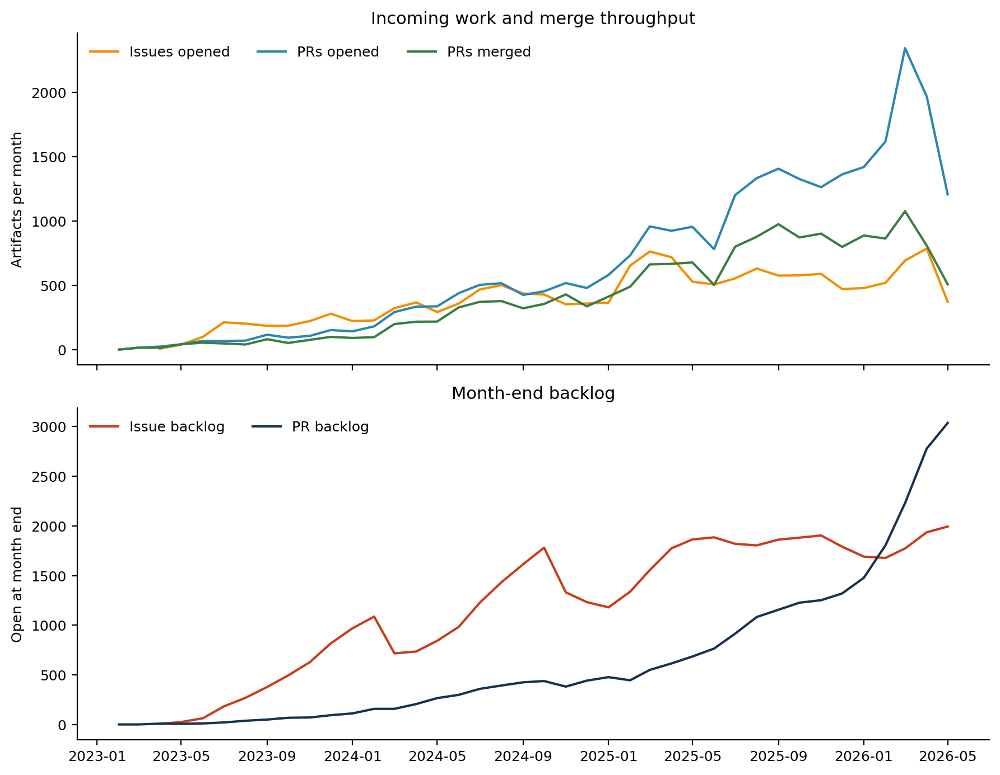

## Data and estimands

This dataset uses Simon Mo's [*vLLM GitHub Gym: vLLM GitHub Snapshot (Fivetran)*](https://gist.github.com/simon-mo/2b0f4e9f872d479a08ae53edac51ecb1) as its base and extends the data through 2026-07-31. The merged database and validation manifest are published in [`vllm-github-data-2026-07-31`](https://github.com/ai-infra-bench/ai-infra-bench/releases/tag/vllm-github-data-2026-07-31).

The analysis covers:

- 49,925 issue/PR artifacts;
- 16,990 issues;
- 32,935 PRs;
- 205,998 issue/PR conversation comments;
- 131,473 submitted reviews;
- 122,491 inline review comments;
- 77,682 PR–commit associations;
- 19,416 default-branch commits.

The comparison periods are project launch–2024, calendar year 2025, and the seven complete months January–July 2026. Current-state and queue estimands are defined at the July 31 cutoff. Fixed 7/14/30/90/180-day outcomes include only cohorts old enough to have the corresponding follow-up. PR response time starts at the first ready-for-review event; drafts never observed ready are excluded from the response risk set. A response must come from someone other than the artifact author.

`repo_collaborator` remains the May 18 permission snapshot. The report therefore uses **May-18 snapshot roster**, not “July maintainers” and not a historical membership claim. Any-human response is the primary estimand; roster response is a capacity sensitivity definition.

## Data quality and reproducibility

All 19 database release validations pass. The analysis additionally checks that:

- canonical artifact, PR, comment, review, inline-comment, commit, and file counts reconcile with the database;
- GitHub PullRequest database IDs map explicitly to their issue database IDs;
- refreshed artifacts use the canonical timeline while unrefreshed artifacts use the original Fivetran history, preventing duplicate pre-base events;
- no analytical event occurs after the cutoff;
- canonical artifact, PR, comment, review, and inline-comment IDs are unique;
- repeated end-to-end runs produce byte-identical `summary.json`, all 19 figures, and all 57 aggregate CSV tables.

Preserved source anomalies include 443 closed artifacts without a close-history row, two current-state/history disagreements, two reviews without an event time, 21 inline comments that cannot map to a canonical PR, and 88 default-branch commits without an associated PR. GitHub's generic artifact state also represents 279 PRs with observed merge events as `CLOSED`; conversely, 168 PRs have a cutoff materialized merge timestamp but no retained merge event. The analysis defines merge by the union of these cutoff-consistent signals and leaves the 168 missing merge actors unknown rather than imputing them.

For 1,799 artifacts, the observed text representation changed after cutoff; 1,227 open PR file lists cannot be proven unchanged after cutoff. Excluding those records changes issue-intent shares by at most 0.75 percentage points, PR work type by 0.28, hardware by 0.28, and topic by 1.00. The workload findings are robust to this boundary.

## Demand, throughput, and backlog

PR demand grew much faster than issue demand. Average monthly PR arrivals rose 96.8% over 2025, versus 35.3% for merges. This is not one transient spike: 2,342 PRs arrived in March, 2,545 in June, and 2,722 in July.

| Month end | Open PRs | Open issues |
|---|---:|---:|
| 2025-12 | 1,320 | 1,791 |
| 2026-03 | 2,230 | 1,773 |
| 2026-04 | 2,779 | 1,937 |
| 2026-05 | 3,125 | 1,993 |
| 2026-06 | 3,472 | 1,970 |
| 2026-07 | **4,194** | **2,055** |

The 2026 cohort contains 14,718 PRs: 6,619 merged, 4,048 closed unmerged, and 4,051 remained open at cutoff. Competing-risk estimates put 30-day merge and closed-unmerged incidence at 48.3% and 18.1%; at 90 days they reach 51.8% and 23.8%.

## The queue visible to maintainers at cutoff

Among 2,055 open issues:

- 1,136 (55.3%) are bug/correctness reports;
- 682 (33.2%) have no non-author human response;
- 1,570 (76.4%) have no May-18-roster response;
- 798 (38.8%) are older than 90 days;
- 519 (25.3%) are both older than 90 days and lack a roster response;
- 165 (8.0%) have a current assignee.

Among 4,194 open PRs:

- 1,528 (36.4%) are bug/correctness changes;
- 757 (18.0%) remain drafts;
- 3,139 (74.8%) have no roster response;
- 3,405 (81.2%) have no submitted roster review;
- 3,013 (71.8%) retain an outstanding review request;
- 1,783 (42.5%) carry a rebase/conflict signal;
- 245 (5.8%) carry a stale signal.

These counts do not imply that every open item deserves action, nor that a correctly rejected or redirected PR is wasted work. They describe the public surface that maintainers must triage, review, redirect, close, or integrate.

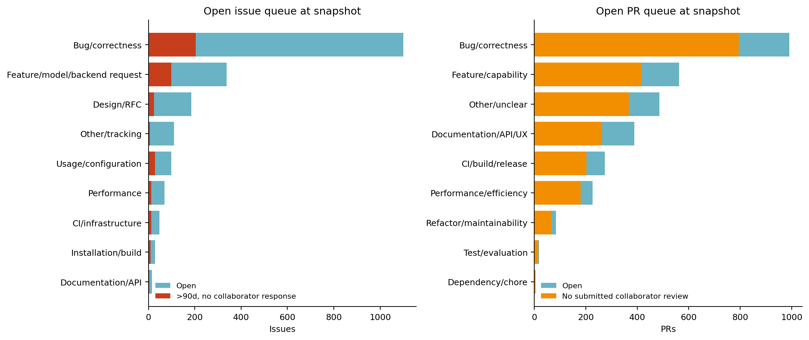

## Responsiveness and formal review

Seven-day response rates are:

| Artifact / responder | Launch–2024 | 2025 | 2026 Jan–Jul |
|---|---:|---:|---:|
| Issue: any non-author human | 65.0% | 59.1% | **53.3%** |
| Issue: May-18 roster | 46.1% | 40.0% | **23.0%** |
| PR: any non-author human | 82.8% | 82.6% | **63.5%** |
| PR: May-18 roster | 79.9% | 80.1% | **57.6%** |
| PR: submitted roster review | 72.1% | 73.8% | **50.8%** |

For the 2026 cohort, 30-day rates are 61.0% for issue any-human response, 27.5% for issue roster response, 72.0% for PR any-human response, 66.6% for PR roster response, and 59.4% for a submitted roster review. Longer follow-up recovers some responses but does not close the early-review gap.

Author role is a major stratifier. Among 2026 PRs eligible for seven-day observation, external-human PRs receive 57.8% any-human and 50.8% roster response, compared with 81.7% and 79.2% for roster-authored PRs. Reporting all PRs together obscures the external contributor experience.

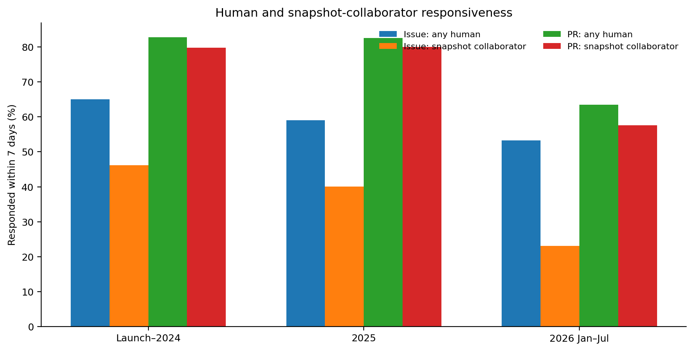

## Issue workload and disposition

The 4,269 issues opened in January–July 2026 consist of:

| Issue intent | Issues | Share |
|---|---:|---:|
| Bug/correctness | 2,475 | 58.0% |
| Feature/model/backend request | 534 | 12.5% |
| Other/tracking | 302 | 7.1% |
| CI/infrastructure | 291 | 6.8% |
| Design/RFC | 282 | 6.6% |
| Usage/configuration | 141 | 3.3% |
| Performance | 129 | 3.0% |

Bug share rose from 55.2% in 2025 to 58.0%. Usage/configuration fell from 13.0% to 3.3%, while CI/infrastructure and design/RFC rose. Template, label, and community-use changes may contribute, so these are descriptive composition changes rather than pure changes in underlying demand.

Among 2026 issues old enough for 90-day follow-up, the share currently marked completed and closed within 90 days is 86.0% for CI/infrastructure, 52.2% for installation/build, 45.0% for bugs, 28.9% for feature/model/backend requests, 22.4% for performance, 20.6% for design/RFC, and 20.8% for usage. These are disposition signals, not unbiased “engineering solved” rates; bots performed 47.2% of 2026 close events.

## What the community changes every day

The 14,718 PRs opened in January–July 2026 break down as follows:

| PR work type | PRs | 2026 share | 2025 share |
|---|---:|---:|---:|
| Bug/correctness | 4,982 | **33.8%** | 22.8% |
| Other/unclear | 2,194 | 14.9% | 16.7% |
| CI/build/release | 2,100 | 14.3% | 16.6% |
| Documentation/API/UX | 1,984 | 13.5% | 20.1% |
| Feature/capability | 1,917 | 13.0% | 13.7% |
| Performance/efficiency | 895 | 6.1% | 5.5% |
| Refactor/maintainability | 486 | 3.3% | 3.6% |
| Test/evaluation | 125 | 0.8% | 0.5% |

The clearest structural change is an 11-point rise in bug/correctness share. Explicit title tags or current labels classify 60.1% of 2026 PRs, deterministic lexical rules classify 25.0%, and 14.9% remain unresolved. These strata are suitable for source-frame analysis, but final benchmark tasks still require human coding.

Outcomes differ materially by type. Ninety-day merge is 48.1% for bugs, 67.0% for CI/build, 49.2% for features, 52.6% for performance work, and 74.7% for refactors. A single undifferentiated PR success metric is therefore inappropriate.

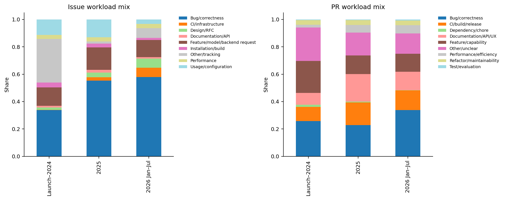

## Implementation, review, and merge ownership

Among 14,643 human-authored PRs in January–July 2026:

- external humans authored 10,993 (75.1%) across 3,401 authors;
- May-18 snapshot write+ users authored 2,896 (19.8%) across 56 authors;
- May-18 snapshot triage-only users authored 754 (5.1%) across 19 authors.

The community supplies most implementation intake, while integration outcomes differ sharply. Among PRs eligible for 90-day outcomes, 42.5% of external PRs merge within 90 days, versus 83.8% for write+ authors and 80.8% for triage-only authors. At least one roster review is observed for 46.9% of external PRs versus 76.8% of write+ PRs. These are associations, not patch-quality effects: task selection, specialization, contributor history, reviewer familiarity, and organizational priority are confounded with author role.

Merge gatekeeping is concentrated among permissioned actors. Among the 6,445 human-authored 2026 merges with an observed actor, 96.1% were performed by users in the May-18 write+ roster, 3.8% by triage-only users, and 0.1% by other actors; 168 additional merge actors are unavailable and are not imputed. Top-five merge-actor share ranges from 43.8% for bugs to 60.2% for refactors.

Within the 103-person May roster, the observed 2026 portfolio is: 72 both engineering and gatekeeping, three engineering only, eight gatekeeping only, and 20 with none of the public actions measured here. The last group must not be called inactive: private discussion, security, release work, CI babysitting, vendor coordination, and other repositories are not observed.

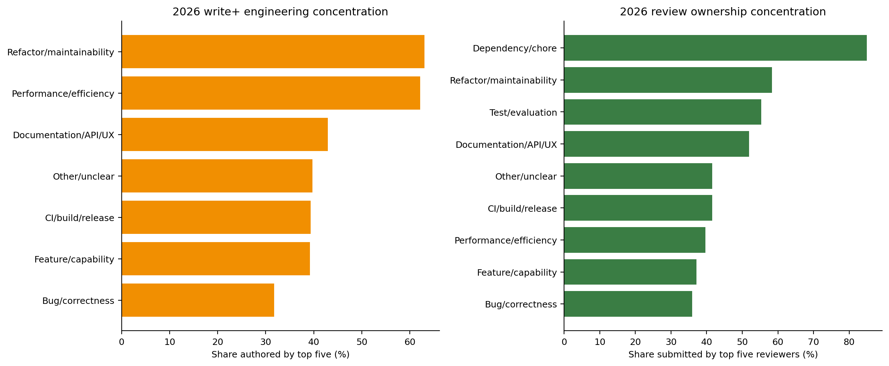

## Review capacity and specialization

Seventy-seven roster members submitted 19,091 non-author reviews in January–July 2026. The top five produced 35.0%, ten people produced half, 23 produced 80%, and the Gini coefficient is 0.664. Relative to the May analysis, the population widened from 75 to 77 and top-five share fell from 39.7% to 35.0%; review became slightly broader, but nowhere near enough to match intake growth.

Top-five shares by action are 35.0% for submitted reviews, 36.2% for inline comments, 34.8% for PR conversation comments, 37.2% for issue conversation comments, 38.9% for label changes, 41.3% for close/reopen events, and 44.4% for merges.

Specialties remain more concentrated than aggregate review. Top-five reviewers account for 61.6% of multimodal/audio reviews, 55.5% of frontend/API, 52.7% of ROCm, 51.3% of XPU, 49.8% of quantization, and 49.6% of MoE. These overlapping heuristic signals are not expertise credentials, but they locate domains where verifier and expert-review capacity is plausibly scarce.

Merged work does not consume all review. In the 2026 creation cohort, merged PRs account for 81.4% of roster review submissions and 74.1% of inline comments; closed-unmerged PRs account for 8.9% and 11.5%; open PRs already account for 9.7% and 14.3%. A merged-only workload census omits 18.6% of submitted reviews and 25.9% of inline review work.

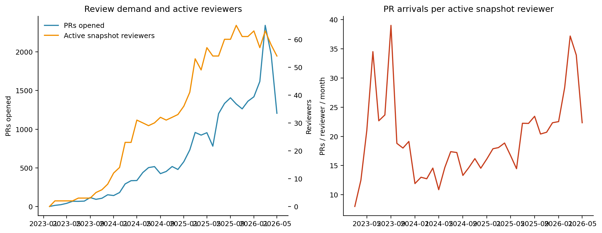

## External contributor lifecycle

The 2026 cohort contains 3,401 external authors and 10,993 external PRs; 2,807 authors are first observed in the dataset during this period.

| External author frequency in Jan–Jul | Authors | PRs | Share of external PRs |
|---|---:|---:|---:|
| One PR | 1,896 | 1,896 | 17.2% |
| 2–4 PRs | 984 | 2,548 | 23.2% |
| 5+ PRs | 521 | 6,549 | **59.6%** |

Broad onboarding and high-volume repeat production coexist. A roster review is observed on 34.0% of first PRs, 43.0% of second–fifth PRs, and 56.9% of sixth-or-later PRs. Ninety-day merge is 27.9%, 38.8%, and 53.8%, respectively. Among first-time 2026 external authors with full 90-day follow-up, 42.0% submit another PR within 90 days. This measures public PR return, not every form of participation.

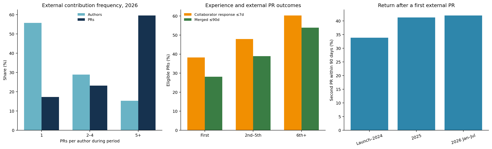

## Inference systems, heterogeneous hardware, and specialist work

The leading multi-label topic signals in 2026 are:

| Topic | PRs | 2026 share | 2025 share |
|---|---:|---:|---:|
| Distributed and parallelism | 5,418 | **36.8%** | 29.1% |
| Attention and kernels | 4,025 | 27.3% | 19.8% |
| V1 engine and model runner | 3,692 | 25.1% | 17.3% |
| Model support | 2,704 | 18.4% | 17.5% |
| Frontend, serving, and APIs | 2,493 | 16.9% | 18.9% |
| KV cache, connectors, and offload | 2,148 | 14.6% | 8.8% |
| Quantization and low precision | 2,133 | 14.5% | 10.9% |
| MoE and expert parallelism | 1,761 | 12.0% | 9.0% |
| Speculative decoding | 1,505 | 10.2% | 7.8% |

The core of inference engineering is not merely model configuration. It combines distributed execution, attention/kernel work, V1 runtime, KV cache, quantization, MoE, speculative decoding, and serving integration.

Hardware signals also expanded:

| Hardware signal | 2026 PRs | 2026 share | 2025 share |
|---|---:|---:|---:|
| NVIDIA/CUDA | 2,505 | 17.0% | 10.7% |
| AMD/ROCm | 2,432 | 16.5% | 10.8% |
| CPU | 1,099 | 7.5% | 5.0% |
| Cross-backend | 1,000 | 6.8% | 4.7% |
| Intel/XPU | 879 | 6.0% | 2.3% |
| TPU | 148 | 1.0% | 6.2% |
| Ascend/NPU | 42 | 0.3% | 0.1% |
| MLU | 0 | 0.0% | 0.0% |

ROCm and CUDA now have similar observable PR volume, and XPU grew substantially. Ascend/NPU and MLU remain too sparse in the vLLM source frame for large representative weights. If included, they should be reported as a maintainer-nominated heterogeneous stress track or supported by data from more relevant repositories.

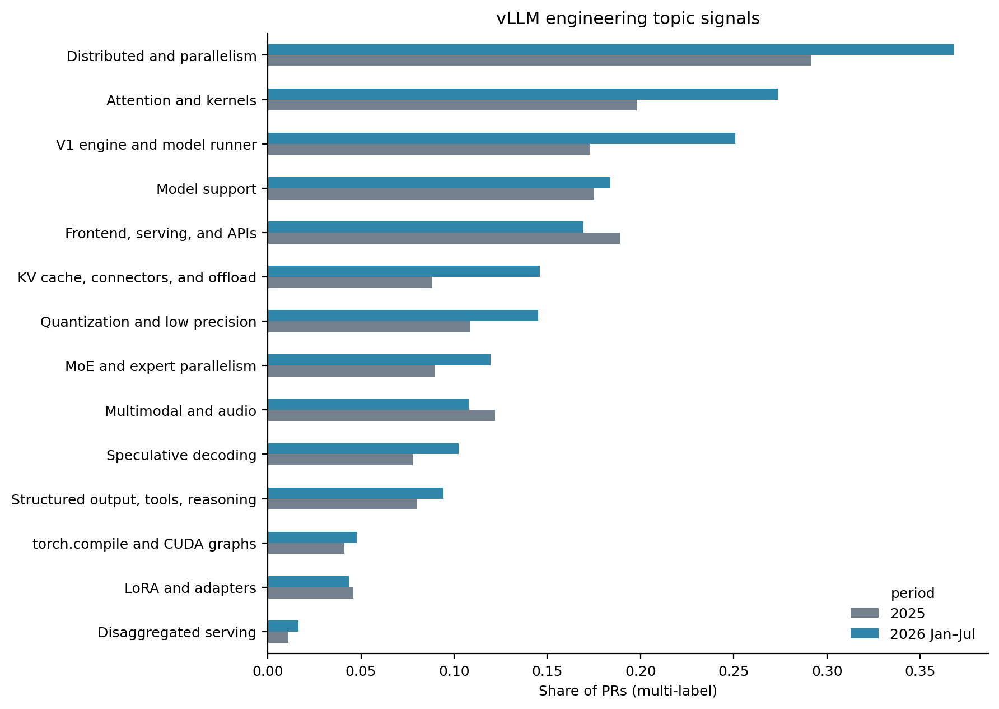

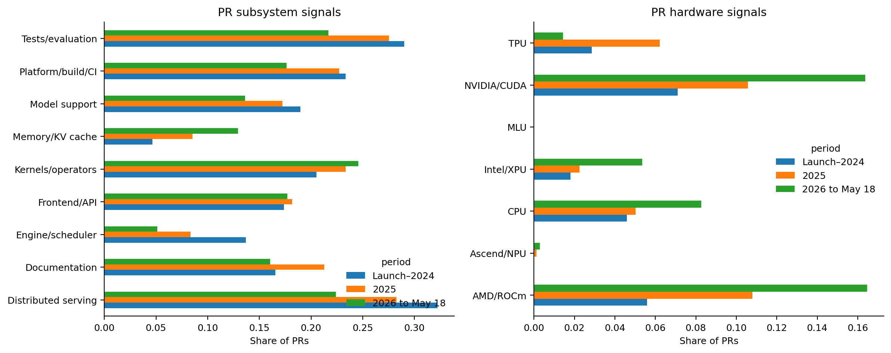

## Direct implications for benchmark construction

The 2026 representative source frame contains 6,613 merged, human-authored PRs with commit data:

- 45.0% touch tests;
- 39.0% carry a hardware signal;
- 5.9% have performance intent;
- 9.6% are large changes;
- 14.5% are review-intensive;
- 2.9% are documentation-only.

Test-file presence is only a visible verifier signal, not evidence that tests fully grade the proposed task. Test-touched shares are 37.4% for performance, 40.2% for bugs, 41.9% for other, 44.9% for features, 47.3% for refactors, 48.2% for docs/API, and 52.4% for CI/build. Performance and bug work are important benchmark categories with relatively weak existing verifier coverage.

Hardware source-frame test coverage is 58.0% for ROCm, 52.8% for CUDA, 54.5% for CPU, 47.9% for XPU, and 72.9% for cross-backend work. The 18 Ascend source-frame PRs show 94.4% test touching, but the sample is tiny and 88.9% are large changes; this does not imply an easy environment.

The 76 representative tasks should stratify at least by:

1. bug/correctness across runtime, kernels, distributed systems, APIs, and model support;
2. feature/capability and model/backend integration;
3. performance/efficiency with continuous reward where appropriate;
4. CI/build/release and cross-platform breakage;
5. refactor/maintainability and architecture migration;
6. test/evaluation and verifier construction;
7. CUDA, ROCm, XPU, CPU, and cross-backend work;
8. distributed execution, attention/kernels, V1, KV cache, quantization, MoE, and speculative decoding;
9. open, closed-unmerged, review-intensive, and maintainer-nominated tasks to cover the merged-only frame's blind spots.

Weights should be based on human-coded eligible records, not copied directly from heuristic shares. The 24 memorable tasks should be reported as a separate targeted track, not mixed into one probability-sampled population pass rate.

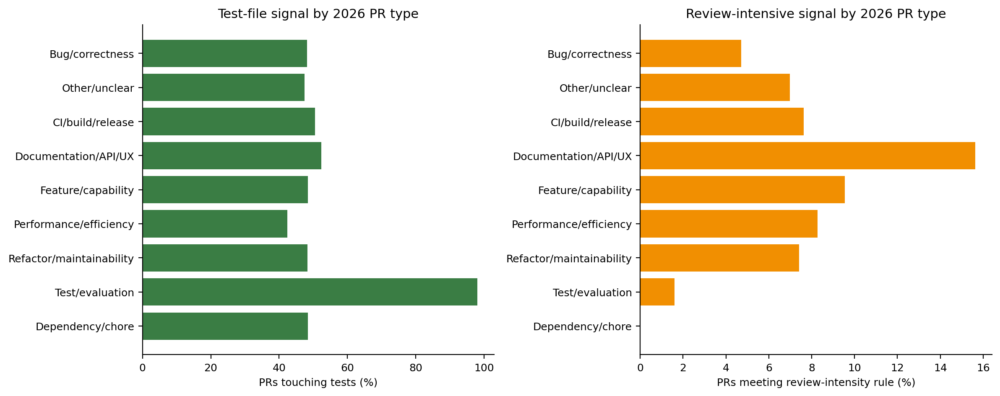

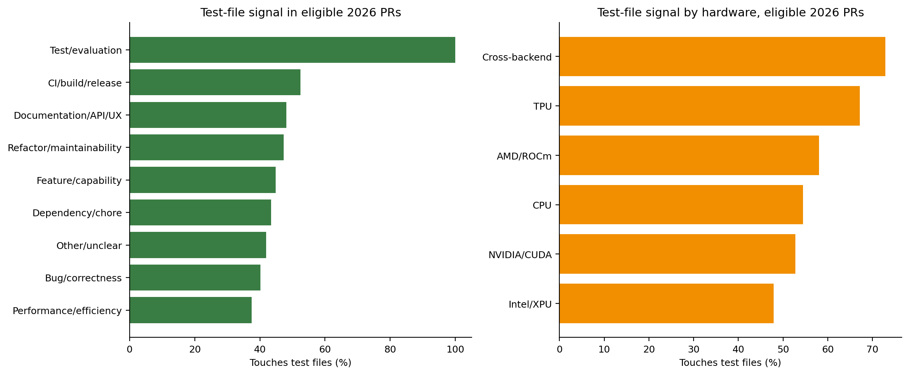

## What changed from the May 18 analysis

With complete May–July data, the earlier central conclusion is stronger:

- estimated 2026 monthly PR intake rises from 1,836.3 to 2,102.6;
- monthly merges rise only from 909.0 to 974.4;
- active roster reviewers fall from the early-year average of 60.3 to a seven-month average of 58.0;
- submitted reviews per new PR fall from 1.55 to 1.35;
- cutoff open PRs increase from 3,037 to 4,194;
- issue seven-day roster response falls from 27.2% to 23.0%;
- PR roster response falls from 62.2% to 57.6%;
- submitted roster review falls from 55.0% to 50.8%.

One statement needs refinement: gatekeeping did not become more concentrated. Top-five review share fell from 39.7% to 35.0%, and active reviewers increased from 75 to 77. The accurate conclusion is: **review participation broadened slightly, but capacity grew far more slowly than demand, so observable review density per PR fell sharply.**

## Limitations

- The May-18 roster is neither the July roster nor a historical membership table.
- GitHub does not capture Slack, private security, vendor coordination, release planning, or local/unsubmitted work.
- Event counts, active days, and review counts cannot be converted to labor hours.
- Title/label/path taxonomies are deterministic exploratory classifications, not human gold labels.
- Content deleted before collection cannot be recovered; post-cutoff text edits have no historical body snapshot.
- Commit timestamps do not reveal when a commit first entered an open PR.
- Delta-refreshed PRs have PR-level file coverage; older PRs use original per-commit file data.
- Review submissions and inline comments do not fully measure thread resolution, synchronous design, or CI babysitting.
- Outcome differences are observational associations, not causal effects of author role, hardware, or work type.

## Answer to RQ1

Real vLLM maintenance is a **high-growth, community-driven, specialist-integration-constrained** system. PR demand nearly doubled in 2026; inference-internal and heterogeneous-hardware work occupies a large and growing share; external authors supply roughly three quarters of human PRs; and review, merge, and specialist gatekeeping still depend on a visible maintainer pool that grows much more slowly.

An AI inference benchmark must therefore test more than ordinary repository editing. It must measure whether agents can diagnose, implement, test, performance-validate, adapt hardware, and respond to review in this workload. The source frame supports both execution-verifiable tasks and tasks requiring synthesized verifiers, real accelerators, or expert judgement. Without those dimensions, the benchmark cannot answer how much real AI inference engineering work LLM agents can solve.
