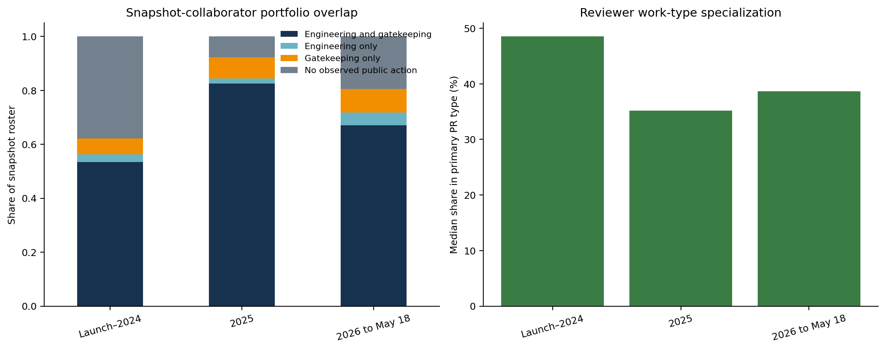

# RQ1 研究结果：vLLM 的真实维护工作负载

数据截止时间：2026-05-18

状态：可复现的定量全量分析已经完成；人工分类验证与维护者 effort 校准仍待完成

英文完整版见 [RQ1 Findings](RQ1_FINDINGS.md)，研究设计与变量定义分别见 [RQ1 Empirical Study Protocol](RQ1_EMPIRICAL_STUDY.md) 和 [RQ1 Operational Codebook](RQ1_CODEBOOK.md)。

## 核心结论

RQ1 要回答的不是“vLLM 有多少个 issue”，而是：

> vLLM 的公开维护工作负载如何变化、由什么工作组成、谁在实现和审核这些工作，以及进入社区的需求是否超过了可观察的维护能力？

截至 2026 年 5 月，vLLM 的维护系统出现了三个同时发生的变化：PR 进入速度显著上升，外部贡献者规模迅速扩大，工程内容向异构硬件和推理系统内部迁移。维护者的公开 review 活动也在增长，但远慢于 PR 数量的增长。

2025 年与 2026 年 1–4 月完整月份的对比如下：

| 月均指标 | 2025 | 2026 年 1–4 月 | 变化 |
| --- | ---: | ---: | ---: |
| 新增 issue | 578.2 | 619.5 | +7% |
| 新增 PR | 1,068.6 | 1,836.2 | +72% |
| 合并 PR | 720.1 | 909.0 | +26% |
| 活跃 snapshot collaborator reviewer | 54.3 | 60.3 | +11% |
| 非作者 collaborator review | 2,316.7 | 2,778.3 | +20% |
| 每位活跃 reviewer 对应的新增 PR | 19.5 | 30.5 | +57% |
| 每个新增 PR 得到的 review | 2.17 | 1.55 | −29% |
| 每个新增 PR 得到的 inline review comment | 1.83 | 1.20 | −35% |

因此，最扎实的 RQ1 结论不是“维护者不工作了”，而是：**可观察的维护能力确实增长了，但 PR intake 增长得更快，单个进入系统的 PR 能获得的 review interaction 明显下降。**

## 1. 数据与研究边界

基础数据来自 Simon Mo 提供的 [*vLLM GitHub Gym: vLLM GitHub Snapshot (Fivetran)*](https://gist.github.com/simon-mo/2b0f4e9f872d479a08ae53edac51ecb1)，SHA-256 为 `1992a9f7011ebe35ba6f62511d5ccc727b233e21d7279db3d3496f9f4892c44d`。

| 数据对象 | 数量 |
| --- | ---: |
| Issue | 15,571 |
| Pull request | 26,768 |
| Issue/PR 顶层评论 | 178,352 |
| Submitted PR review | 114,154 |
| Inline review comment | 110,113 |
| Commit | 29,659 |
| Commit-file change | 405,311 |

报告按三个观察窗口分析：项目启动至 2024 年、2025 年、2026 年至 5 月 18 日。月度趋势是主要分析单位；2026 年 5 月是不完整月份，不进入完整月份的月均比较。

本研究测量的是 GitHub 中可观察的公开活动：需求进入、合并和关闭、响应、review、代码变更和公开队列。它不能直接测量私下讨论、阅读代码但不留言、复现和 profiling 时间、会议、Slack 沟通或真实工程小时数。

### 数据质量边界

- 当前 collaborator 表包含 103 名具有 triage 或更高权限的用户，其中 70 名具有 write 或更高权限，但没有历史加入和退出时间。因此报告使用 **snapshot collaborator**，不把今天的权限倒推成历史 maintainer 身份。
- Open PR 的 commit/file 覆盖显著低于 merged PR，因此 patch size 只用于描述可重建的代码变更，不能用来估计 merge probability。
- 两条 submitted review 缺少 `submitted_at`：它们保留在 PR-level review burden 中，但不进入按事件时间计算的 ownership。
- `commit` 表中有 2,733 个不同 author email，但只有 117 个 committer email；squash、merge 和自动化使 git committer 不适合作为“谁完成工程工作”的定义。

本文因此使用 PR author 表示实现主体、merge actor 表示最终集成动作、非作者 reviewer/commenter 表示公开 gatekeeping 工作。

## 2. Demand、throughput 与 backlog

PR demand 的变化远大于 issue demand。2026 年 1–4 月，新增 PR 月均比 2025 年高 71.8%，但合并吞吐只增长 26.2%。

PR backlog 从 2025 年 12 月底的 1,296 个，上升到 2026 年 4 月底的 2,779 个，并在 5 月 18 日达到 3,037 个。Issue backlog 同期从 1,791 个增加到 1,994 个。

在快照时点：

- 1,994 个 issue 仍然 open，其中 697 个已经超过 90 天；
- 1,396 个 open issue 没有可观察的 snapshot-collaborator response；
- 只有 10.0% 的 open issue 有当前 assignee；
- 3,037 个 PR 仍然 open，其中 2,266 个没有 submitted collaborator review；
- 2,141 个 open PR 至少存在一个 outstanding review request。

这些数字不意味着每个 item 都应该被接受或处理，但它们比 GitHub 页面上的累计总数更接近维护者真正面对的 operational queue。

## 3. 响应速度

任意非作者 human 在 7 天内响应的比例：

| Artifact | 启动–2024 | 2025 | 2026 至 5 月 18 日 |
| --- | ---: | ---: | ---: |
| Issue | 65.0% | 59.1% | 53.7% |
| Ready PR | 82.8% | 82.5% | 66.9% |

如果只看当前 snapshot collaborator，issue 的 7 天响应率从 46.1% 降到 27.2%，ready PR 从 79.9% 降到 62.2%。

Conversation response 与 code review 不是同一个指标。非作者 snapshot collaborator 在 7 天内提交正式 review 的比例，从启动–2024 的 72.1% 和 2025 年的 73.8%，下降到 2026 年的 55.0%。

所有固定时间窗口都只使用拥有完整观察窗口的 artifact。Open 和尚未响应的 artifact 被作为 right-censored observation 保留，而不是删除。

## 4. 用户在 issue 中提出什么问题

Issue intent 与 PR work type 是两个不同概念。Issue 表达用户需求，PR 表达实际进入代码库的变更；不能用 merged PR 代替全部用户问题。

探索性分类包括：bug/correctness、feature/model/backend request、usage/configuration、installation/build、performance、documentation/API、design/RFC、CI/infrastructure 和 other/tracking。

当前结果可以用于确定 benchmark 的大类和人工标注抽样层，但不能直接冻结为 paper-grade taxonomy。标题模板和 label 随时间变化，正式发布前仍需进行时间分层的双人标注、adjudication，并报告每一类的 precision、recall 和 agreement。

## 5. PR 都在做什么

2025 年和 2026 年的 PR work-type 分布总体稳定，但 bug/correctness 明显增加：

| PR 类型 | 2025 | 2026 至 5 月 18 日 |
| --- | ---: | ---: |
| Bug/correctness | 24.0% | 32.0% |
| CI/build/release | 19.4% | 13.1% |
| Documentation/API/UX | 21.9% | 14.2% |
| Feature/capability | 13.8% | 13.8% |
| Performance/efficiency | 5.5% | 6.6% |
| Refactor/maintainability | 3.6% | 4.2% |
| Other/unclear | 16.7% | 15.1% |

Test/evaluation 很少作为 PR 的唯一主要目的，但测试文件经常出现在 bug、feature、refactor 和 hardware PR 中。因此 benchmark 必须把 **work intent** 与 **是否存在 test/verifier signal** 分开。

PR 的 merge 与 closed-unmerged 是 competing outcomes。对于拥有完整 90 天观察期的 2026 cohort，53.8% 在 90 天内合并，21.8% 在 90 天内关闭但未合并。不能把 closed-unmerged 当作普通 censoring，否则会高估 merge probability。

## 6. 谁在实现这些 PR

2026 年共有 8,532 个 human-authored PR：

- external human：6,117 个，71.7%；
- 当前 snapshot write+：1,997 个，23.4%；
- 当前 snapshot triage-only：418 个，4.9%。

但不同 PR 类型的作者结构差异很大：

| 2026 PR 类型 | External human | Triage-only | Write+ |
| --- | ---: | ---: | ---: |
| Bug/correctness | 79.4% | 4.2% | 16.4% |
| Feature/capability | 78.1% | 3.1% | 18.8% |
| Documentation/API/UX | 75.4% | 2.3% | 22.3% |
| Performance/efficiency | 72.5% | 1.4% | 26.1% |
| CI/build/release | 52.5% | 13.5% | 34.0% |
| Refactor/maintainability | 41.4% | 6.8% | 51.8% |

外部社区是 bug 和 feature 实现的主要来源，而 current write+ contributor 更集中在 refactor、performance、CI/build 和系统内部工作。

这种差异在具体代码路径中更加明显。External contributors 贡献了大部分进入项目的 PR，但 current collaborators 在 benchmark/eval、platform/backend、compilation、native kernel、distributed executor、frontend 和 CI/build 路径中占主导。

2026 年有 55 名 current write+ author 提交了 1,997 个 PR。整体上，top 5 author 占 32.5%，10 人完成一半，21 人完成 80%。但专业领域更加集中：top 5 author 完成了 63.0% 的 write+ refactor、62.2% 的 performance、71.4% 的 XPU、68.8% 的 compilation/CUDA graph、68.6% 的 disaggregated serving 和 68.6% 的 MoE/expert-parallel PR。

这不是个人排名，也不是对项目组织方式的批评。它说明 benchmark 的 rare-topic task 不能交给任意 reviewer 验证：某些 accelerator、runtime 和 kernel 工作依赖很少的 domain experts。

## 7. Maintainer 在公开工作流中做什么

| Snapshot collaborator 月均公开动作 | 2025 | 2026 年 1–4 月 | 变化 |
| --- | ---: | ---: | ---: |
| 非作者 submitted review | 2,316.7 | 2,778.3 | +19.9% |
| 非作者 inline review comment | 1,949.3 | 2,132.3 | +9.4% |
| 非作者 PR conversation comment | 926.1 | 1,125.3 | +21.5% |
| 非作者 issue conversation comment | 710.4 | 476.8 | −32.9% |
| Label change | 750.7 | 1,229.8 | +63.8% |
| Close/reopen event | 1,033.0 | 1,362.8 | +31.9% |
| Merge | 720.1 | 909.0 | +26.2% |

PR-facing activity 几乎都在增长，但 PR intake 增长得更快。Issue conversation comment 在 issue intake 增加的同时下降 32.9%，说明维护能力进一步向 PR integration 和 repository operations 偏移。

当前 103 人 roster 中，2026 年有：

- 69 人同时进行 engineering 和至少一种 gatekeeping；
- 5 人只观察到 PR authorship；
- 9 人只观察到 review、issue response 或 merge；
- 20 人在这些公开动作中没有记录。

最后一类不能解释为“没有工作”，因为历史 membership、private work、其他 repo 和大量线下活动不可见。

## 8. Review 工作由谁承担

2026 年有 75 名 snapshot collaborator 提交了带时间戳的非作者 review，共计 12,506 次：

- 8 人完成一半 review；
- 21 人完成 80%；
- top 5 完成 39.7%；
- Gini 为 0.688。

Review 在粗粒度 PR 类型上相对广泛，但在具体技术主题上集中。Top 5 reviewer 承担了 62.1% 的 multimodal/audio review、61.8% 的 frontend/API、58.8% 的 model support、55.3% 的 LoRA、54.8% 的 MoE、53.6% 的 quantization 和 52.6% 的 compilation/CUDA graph review。

此外，review 并不只花在最终 merged 的 PR 上。2026 cohort 的 open 与 closed-unmerged PR 合计吸收了 21.0% 的 submitted collaborator reviews 和 30.1% 的 inline review comments。Review 可以正确拒绝、重定向或改进贡献，因此这不应叫作“浪费”；但只从 merged PR 构造 benchmark 会系统性遗漏这些维护工作。

## 9. External contributor lifecycle

2026 年至 5 月 18 日共有 2,105 名 external human 提交过 PR：

- 1,188 人只提交一个 PR，占 external author 的 56.4%，贡献 19.4% 的 external PR；
- 616 人提交 2–4 个，占 29.3%，贡献 26.0%；
- 301 人提交至少 5 个，占 14.3%，却贡献 54.6% 的 external PR。

这意味着维护者同时面对很宽的 onboarding population，以及一个较小但贡献大多数 PR 的 repeat-contributor population。

| 2026 external PR experience | PR 数 | External PR 占比 | 7 天 collaborator response | 得到 collaborator review | 90 天内 merge |
| --- | ---: | ---: | ---: | ---: | ---: |
| First observed PR | 1,575 | 25.7% | 43.3% | 37.0% | 40.1% |
| 2nd–5th observed PR | 1,851 | 30.3% | 54.5% | 46.7% | 45.6% |
| 6th+ observed PR | 2,691 | 44.0% | 62.5% | 57.4% | 63.4% |

这些是 selection 下的描述性关系，不能解释为“熟人获得优待”或“首次贡献质量更差”。Repeat contributor 具有历史经验，也可能选择完全不同的 task。Benchmark 应把 first-time 与 repeat-contributor PR 作为 secondary strata；否则可能只测到熟悉 repository 的贡献者工作，或者反过来过度采样一次性简单贡献。

## 10. 推理系统主题与异构硬件

2026 年最常见的 inference-engineering topic signals 包括：

| Topic signal | 2025 | 2026 至 5 月 18 日 | 变化 |
| --- | ---: | ---: | ---: |
| Distributed and parallelism | 28.5% | 22.9% | −5.6 pp |
| Attention and kernels | 19.6% | 21.5% | +1.9 pp |
| KV cache/connectors/offload | 8.8% | 13.3% | +4.5 pp |
| V1 engine/model runner | 16.8% | 13.1% | −3.8 pp |
| Quantization/low precision | 10.8% | 12.4% | +1.6 pp |
| Multimodal/audio | 12.2% | 11.8% | −0.4 pp |
| MoE/expert parallelism | 8.8% | 11.3% | +2.5 pp |
| Speculative decoding | 7.8% | 9.7% | +2.0 pp |
| Structured output/tools/reasoning | 8.0% | 9.2% | +1.2 pp |
| torch.compile/CUDA graph | 4.1% | 5.8% | +1.7 pp |

在 merged、human-authored 且具有 commit data 的 benchmark source frame 中，具有 hardware signal 的 PR 从启动–2024 的 17.8% 上升到 2026 年的 36.8%。ROCm、CUDA、XPU、CPU、cross-backend、kernel 和 KV-cache 工作都在变得更重要。

这为 hardware-aware AI inference benchmark 提供了直接证据，但同时也给出了边界：当前 vLLM 数据中几乎没有 MLU，Ascend/NPU 也很少。它们可以作为 maintainer 指定的 strategic stress track，但不能伪装成 observed vLLM workload 中的代表性大权重 strata。

## 11. 对 benchmark 构造的直接含义

快照中有 16,627 个 merged、human-authored、具有 commit data 的 PR。它们只是 implementation task 的 source population，不是“16,627 道可以直接运行的题”。

| Source period | Source-frame PR | Touch test | Hardware signal | Performance | Large change | Review-intensive |
| --- | ---: | ---: | ---: | ---: | ---: | ---: |
| 启动–2024 | 3,944 | 33.3% | 17.8% | 1.8% | 9.9% | 13.1% |
| 2025 | 8,746 | 34.3% | 26.9% | 5.4% | 7.4% | 14.6% |
| 2026 至 5 月 18 日 | 3,937 | 41.6% | 36.8% | 6.2% | 10.0% | 14.8% |

### Verifier 不是“看到 tests 目录”就够了

Bug PR 中只有 35.0% 修改 test file，feature 为 42.6%，performance 为 34.7%。只有 performance 工作较常修改明确的 benchmark/eval path。Hardware PR 的 test-path signal 更高，但这些测试通常依赖特定 accelerator、driver、compiler、checkpoint 或 distributed topology。

Patch size 与 review intensity 也高度相关。2026 merged source-frame 中，累计 churn 为 20 行以内的 PR 只有 3.6% 被标记为 review-intensive；21–100 行为 11.2%，101–500 行为 24.9%，501–2,000 行为 42.2%。

### 建议分成三个主要 task contract

1. **Implementation**：从可重建的 pre-change state 实现 bug fix、feature、performance change、refactor、test、CI/build 或 API change。
2. **Diagnosis/reproduction**：从真实 issue 出发，要求复现、root-cause localization 或可执行诊断；不强制每题都有一个唯一 reference patch。
3. **Review**：给定 candidate patch，要求识别 correctness、performance、hardware、API 或 design 问题，并覆盖 merged、rejected、redirected 和 contested changes。

Memorable tasks 与 targeted hardware tasks 应单独报告。它们衡量高价值 tail capability，不代表 observed workload prevalence。

抽样至少要保留以下维度：work type、technical topic、subsystem、hardware、author role、contributor experience、test signal、patch size 和 review intensity。Core runtime/refactor 与 external community-facing bug/feature 是不同的工作流，不能只按 PR 总体比例简单抽样。

## 12. 目前可以说什么，不能说什么

现有证据足以支持：

- vLLM 的 PR demand 增长显著快于公开 review capacity；
- external contributors 已成为 PR intake 的主体；
- core contributors 更多承担 runtime、integration、refactor 和基础设施工作；
- engineering、review 与 merge authority 在 specialty 中存在明显集中；
- heterogeneous hardware 与 inference-runtime work 正在成为更大的维护组成；
- merged-PR-only benchmark 会遗漏 diagnosis、triage、rejected contribution 和大量 review workload。

现有证据还不足以支持：

- “维护者已经 burnout”或“项目人手不足”的因果结论；
- 把评论数、review 数或 elapsed time 直接换算成工程小时；
- 把 external/core outcome 差异解释为贡献者质量；
- 声称 agent 可以解决全部 maintainer workload 的某个单一百分比；
- 把 NPU/MLU 赋予很高的 workload-representative 权重。

在正式发布“LLM 能解决多少真实 AI inference workload”之前，还需要：

1. 对 issue 与 PR taxonomy 进行时间分层、双人编码和 held-out validation；
2. 获取历史 collaborator/maintainer membership interval；
3. 标注 response 是否 substantive；
4. 与 maintainer 做 ordinal active-review-time calibration；
5. 对 probability sample 记录 environment reconstruction、offline solvability 和 verifier feasibility；
6. 分开构造 implementation、diagnosis 和 review populations，并记录 feasibility attrition；
7. 对 stacked PR、follow-up fix、revert 和 release train 做 dependency clustering。

## 图表索引

全部 19 张图位于 [`docs/assets/rq1/`](assets/rq1/)：

1. `activity_and_backlog.png`：需求、吞吐与 backlog
2. `current_queues.png`：当前 issue/PR operational queue
3. `response_within_7_days.png`：7 天响应率
4. `response_survival.png`：响应 time-to-event 曲线
5. `workload_mix.png`：issue intent 与 PR work-type mix
6. `pr_competing_outcomes.png`：merge/closed-unmerged competing outcomes
7. `pr_authorship_by_type.png`：不同 PR 类型的作者角色
8. `path_area_ownership.png`：具体代码路径 ownership
9. `engineering_and_review_ownership.png`：实现与 review 集中度
10. `maintainer_workload.png`：公开 maintainer actions
11. `collaborator_portfolios.png`：engineering/gatekeeping portfolio
12. `review_capacity.png`：review demand 与 capacity
13. `contributor_pressure.png`：external intake 与 reviewer capacity
14. `external_contributor_lifecycle.png`：首次/重复贡献者 lifecycle
15. `engineering_topics.png`：inference-engineering topics
16. `subsystems_and_hardware.png`：subsystem 与 hardware signals
17. `benchmark_task_signals.png`：benchmark source-frame task signals
18. `verifier_signals.png`：不同 task/hardware 的 test signal
19. `pr_complexity.png`：patch complexity、review 与 verifier signal

## 一句话结论

vLLM 的公开维护系统已经成为一个由大量 external implementation 驱动、由较小的 core maintainer 集体完成 integration 和 specialist review、并快速向异构硬件与推理系统内部扩张的工程系统；AI Infra Bench 必须同时覆盖实现、诊断与 review，才能诚实回答 agent 能解决多少真实 workload。
