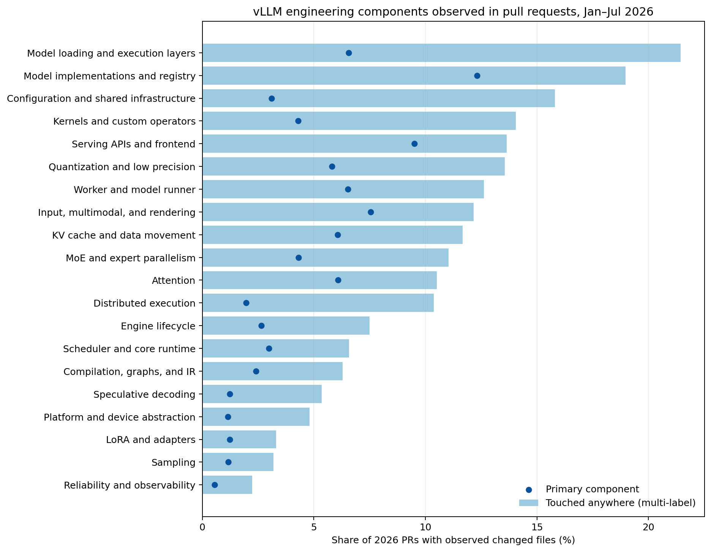

# vLLM component taxonomy for benchmark design

## Executive answer

vLLM does have meaningful component boundaries, but no single repository signal is a complete taxonomy. The most defensible classification combines four sources at the **2026-07-31** cutoff:

1. the source tree at commit `e3be89673db6143c1f9c8689d853b9c7c7a5eb29`;
2. `.github/CODEOWNERS`, which explicitly marks core paths requiring careful review;
3. 34 maintainer-authored Buildkite test areas and 19 hardware-CI jobs; and
4. changed paths from 14,718 pull requests opened during January–July 2026.

The result should not be a flat list containing `bugfix`, `scheduler`, `ROCm`, and `tests`. Those describe different properties. Benchmark records should instead have separate fields for:

- **work type**: bug/correctness, feature, performance, refactor, test, documentation, CI/build, and so on;
- **architectural layer**: one of six broad system layers;
- **operational component**: the multi-label component list below, with an optional primary component for stratified sampling;
- **hardware/backend**: CUDA/NVIDIA, ROCm/AMD, CPU, XPU/Intel, TPU, Ascend, or an external backend;
- **verification surface**: unit, integration, distributed, model, kernel, performance, build, or hardware-specific tests; and
- **model or capability family**, when it is useful beyond the operational component labels.

This is the central design conclusion: **PR work type and engineering component are independent axes, and component assignment must be multi-label.** In the observed data, 53.0% of component-classified PRs touch more than one component.



## Proposed hierarchy

The six level-1 layers describe the architecture. The 20 level-2 operational components are the recommended benchmark strata. Narrow domains such as attention and quantization intentionally overlap their containing execution-layer paths.

| Architectural layer | Operational component | Repository anchors and responsibility |
|---|---|---|
| Runtime control plane | Scheduler and core runtime | `vllm/v1/core/`, especially scheduling, block coordination, and core state machines |
| Runtime control plane | Engine lifecycle | `vllm/v1/engine/` and `vllm/engine/`; sync/async engine APIs, processes, lifecycle, and IPC |
| Serving and request interface | Serving APIs and frontend | `vllm/entrypoints/` and `rust/`; OpenAI/Anthropic APIs, CLI, MCP, pooling, scale-out, and the Rust frontend |
| Execution data plane | Worker and model runner | `vllm/v1/worker/`; device workers, model runners, execution state, and execution loops |
| Execution data plane | KV cache and data movement | KV allocation, cache managers, connectors, offload, and prefill/decode transfer |
| Execution data plane | Distributed execution | `vllm/distributed/`, executors, collectives, and tensor/data/pipeline parallelism |
| Execution data plane | MoE and expert parallelism | fused-MoE layers and kernels, expert parallelism, routing, and load balancing |
| Execution data plane | Sampling | `vllm/v1/sample/`, logits processing, sampling algorithms, and output selection |
| Execution data plane | Speculative decoding | `vllm/v1/spec_decode/`; draft-model, EAGLE, Medusa, and MTP flows |
| Model and data semantics | Input, multimodal, and rendering | input processing, multimodal data, tokenization, chat rendering, parsers, tools, and structured output |
| Model and data semantics | Model implementations and registry | model architectures, registry integration, processors, and model-specific behavior |
| Model and data semantics | Model loading and execution layers | weight loading, generic neural-network layers, warmup, offload, and execution utilities |
| Model and data semantics | LoRA and adapters | LoRA execution, adapter management, resolvers, and related kernels |
| Kernels and compilation | Attention | attention backends/layers, paged attention, and flash-attention integration |
| Kernels and compilation | Kernels and custom operators | native, Triton, and Helion operators and low-level bindings not owned by a narrower domain |
| Kernels and compilation | Quantization and low precision | formats, quantized layers, low-precision execution, and quantized kernels |
| Kernels and compilation | Compilation, graphs, and IR | `torch.compile`, graph capture, compilation passes, and vLLM IR |
| Platform and operations | Platform and device abstraction | runtime selection and behavioral abstraction for device backends and plugins |
| Platform and operations | Reliability and observability | fault tolerance, health, metrics, tracing, profiling, logging, and telemetry |
| Platform and operations | Configuration and shared infrastructure | configuration, environment settings, shared utilities, and common public parameters |

Tests, CI/build, packaging, documentation, examples, and benchmarks are recorded as **support or verification surfaces**, not architecture components. A test-only PR can still be mapped to a component when its test path mirrors that component.

## What maintainers encode directly

### CODEOWNERS: careful-review surfaces

The cutoff snapshot contains 160 CODEOWNERS path entries. Its own header says that it lists core components requiring careful review, so it is strong evidence for review boundaries but not an exhaustive architecture. The patterns cover 2,358 of 3,463 tracked production files (68.1%). Among 2026 PRs with observed file lists, 10,674 (83.4%) touch at least one CODEOWNERS path.

The strongest repeated ownership domains are frontend/entrypoints, input and output processing, attention, model implementations, model execution, KV transfer/offload, workers, kernels, configuration, and distributed execution. CODEOWNERS also has backend-specific sections for CPU, Intel GPU, ROCm, and TPU. It does not provide one universal label for every PR and should not be treated as historical maintainer membership: this is the ownership file at the cutoff.

### Buildkite: operational test domains

`.buildkite/test_areas/` contains 34 groups and 205 test steps. The groups include Attention, Compile, Disaggregated, Distributed, Engine, Entrypoints, Expert Parallelism, Fault Tolerance, Kernels, LoRA, Model Executor, model families, Model Runner V2, Plugins, Quantization, Samplers, Spec Decode, and Weight Loading, plus evaluation and repository-level groups.

Of the 205 steps, 169 map to at least one proposed component and 124 span multiple components. This supports multi-label classification: for example, an engine end-to-end test deliberately depends on engine, configuration, compilation, distributed execution, model execution, platforms, and V1 runtime paths.

Hardware CI is a separate axis. The snapshot has 19 hardware-job definitions covering CPU/Arm, AMD image construction, Intel XPU, Ascend NPU, GH200, and Intel HPU. Five jobs are optional and five are soft-fail. AMD functional coverage is also expressed through mirrors of the main test areas rather than only through the hardware-job directory. For benchmark design, “component coverage” and “backend environment coverage” therefore need separate quotas.

## What developers actually changed in 2026

Of 14,718 PRs opened from January through July, 12,799 (87.0%) have changed-file evidence in the merged dataset. The taxonomy maps 11,196 of those (87.5%) to an engineering component. Of the 1,603 PRs with files but no component assignment, 1,466 (91.5%) touch only support surfaces such as CI/build, documentation, benchmarks, examples, or generic tests. Restricting to cutoff-stable file snapshots gives nearly the same coverage: 10,082 of 11,592, or 87.0%.

Counts below are multi-label in the “touched anywhere” column and therefore do not sum to the number of PRs. The primary component is a deterministic sampling aid: source files receive weight 2, test files weight 1, and the highest component score wins, with narrow components winning ties. It is not an assertion that cross-component work has only one owner.

| Layer | Component | Touched anywhere | Primary component |
|---|---|---:|---:|
| Model and data semantics | Model loading and execution layers | 2,744 (21.4%) | 840 (6.6%) |
| Model and data semantics | Model implementations and registry | 2,429 (19.0%) | 1,577 (12.3%) |
| Platform and operations | Configuration and shared infrastructure | 2,024 (15.8%) | 398 (3.1%) |
| Kernels and compilation | Kernels and custom operators | 1,799 (14.1%) | 550 (4.3%) |
| Serving and request interface | Serving APIs and frontend | 1,746 (13.6%) | 1,217 (9.5%) |
| Kernels and compilation | Quantization and low precision | 1,736 (13.6%) | 743 (5.8%) |
| Execution data plane | Worker and model runner | 1,616 (12.6%) | 835 (6.5%) |
| Model and data semantics | Input, multimodal, and rendering | 1,557 (12.2%) | 966 (7.5%) |
| Execution data plane | KV cache and data movement | 1,494 (11.7%) | 776 (6.1%) |
| Execution data plane | MoE and expert parallelism | 1,413 (11.0%) | 553 (4.3%) |
| Kernels and compilation | Attention | 1,346 (10.5%) | 778 (6.1%) |
| Execution data plane | Distributed execution | 1,329 (10.4%) | 251 (2.0%) |
| Runtime control plane | Engine lifecycle | 959 (7.5%) | 339 (2.6%) |
| Runtime control plane | Scheduler and core runtime | 842 (6.6%) | 383 (3.0%) |
| Kernels and compilation | Compilation, graphs, and IR | 805 (6.3%) | 308 (2.4%) |
| Execution data plane | Speculative decoding | 686 (5.4%) | 158 (1.2%) |
| Platform and operations | Platform and device abstraction | 615 (4.8%) | 147 (1.1%) |
| Model and data semantics | LoRA and adapters | 423 (3.3%) | 157 (1.2%) |
| Execution data plane | Sampling | 408 (3.2%) | 149 (1.2%) |
| Platform and operations | Reliability and observability | 287 (2.2%) | 71 (0.6%) |

The high-frequency files validate the proposed boundaries: `vllm/v1/core/sched/scheduler.py` anchors scheduling; `vllm/v1/engine/core.py` anchors engine lifecycle; GPU model runners anchor execution; `parallel_state.py` and the multiprocess executor anchor distributed work; OpenAI serving and protocol files anchor frontend work; and attention, fused-MoE, quantization, and compilation each have dense, separately owned implementation trees.

### Cross-component coupling is a benchmark property

The largest overlaps are not noise. Model loading/execution co-occurs with quantization in 1,310 PRs and with MoE in 1,148. Distributed execution co-occurs with KV cache/data movement in 835 PRs, with a Jaccard overlap of 0.42. Kernels co-occur with quantization in 827 PRs. These are exactly the boundary-crossing tasks likely to stress coding agents because a locally plausible edit may violate a runner, backend, memory-transfer, or kernel contract elsewhere.

The benchmark should therefore retain a cross-component flag and deliberately sample both:

- **single-component tasks**, which measure local implementation and debugging ability; and
- **boundary tasks**, which require coordinated changes across components or layers.

## Implications for task sampling

A 100-task release should not mechanically match raw PR frequency. Raw frequency would overrepresent model-support and execution-layer churn while underrepresenting rare but strategically important scheduler, distributed, kernel, reliability, and heterogeneous-backend work. A defensible selection procedure is:

1. stratify first by work type and primary component;
2. preserve secondary component labels and reserve an explicit quota for boundary tasks;
3. add backend quotas, including tasks that require CUDA, ROCm, CPU/XPU, and external accelerator environments;
4. add verifier quotas for unit, end-to-end, distributed, kernel-correctness, performance, build, and hardware-specific testing;
5. separate representative frequency-weighted tasks from maintainer-nominated memorable tasks; and
6. have maintainers review both the taxonomy assignment and the final task-level verifier.

The component classifier should be used for candidate discovery and quota construction, not as unreviewed ground truth. Before freezing the benchmark, a stratified human-coded sample should estimate precision, recall, disagreement, and the rate at which the primary-component rule hides meaningful secondary work.

## Reproducibility and limitations

Run:

```bash
git clone --filter=blob:none https://github.com/vllm-project/vllm.git \
  data/raw/vllm-source-2026-07-31
git -C data/raw/vllm-source-2026-07-31 checkout \
  e3be89673db6143c1f9c8689d853b9c7c7a5eb29
python3 analysis/rq1/analyze_vllm_components.py
```

The script writes the aggregate summary to `analysis/rq1/component_summary.json`, reproducible CSV tables under the ignored `analysis/rq1/outputs/components/` directory, and the figure used above. It includes representative-path assertions to prevent obvious taxonomy regressions.

Important limitations are:

- Changed-file evidence is unavailable for 1,919 of the 14,718 PRs, and availability is not guaranteed to be random.
- Open PR file snapshots that cannot be proven stable at the cutoff are retained with an explicit stability flag; the stable-only sensitivity result is reported above.
- The source tree, CODEOWNERS, and Buildkite definitions describe the cutoff state, not the repository's ownership or architecture at every historical date.
- Path matching cannot recover semantic intent by itself. Dynamic behavior, generated code, and a change whose real effect is outside the edited directory can produce false negatives or secondary-label omissions.
- External accelerator integrations may live in plugin repositories rather than vLLM core. Core-repository analysis alone is insufficient for Ascend, MLU, or other heterogeneous benchmark tracks.
- Source lines and file counts describe implementation footprint, not maintainer effort or task difficulty.

The PR data comes from the merged vLLM GitHub dataset through 2026-07-31, which uses Simon Mo's [*vLLM GitHub Gym: vLLM GitHub Snapshot (Fivetran)*](https://gist.github.com/simon-mo/2b0f4e9f872d479a08ae53edac51ecb1) as its base and extends it through July 31.
